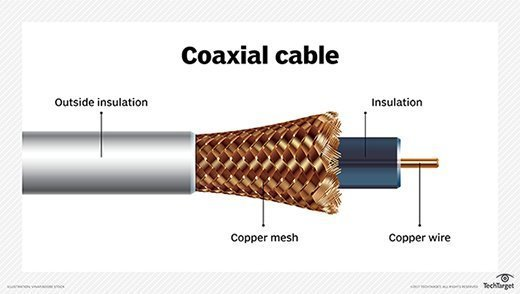
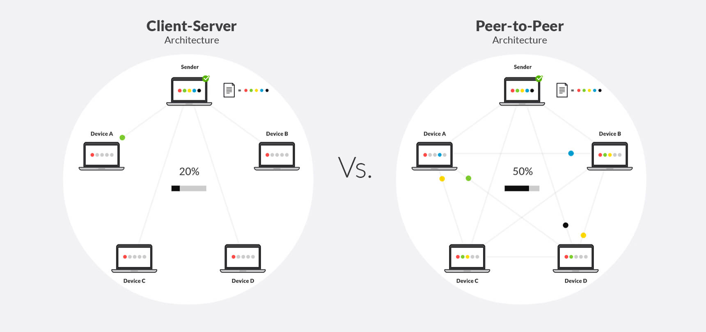
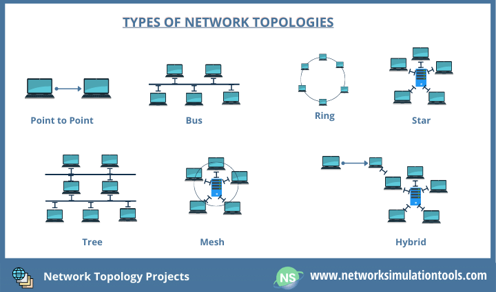
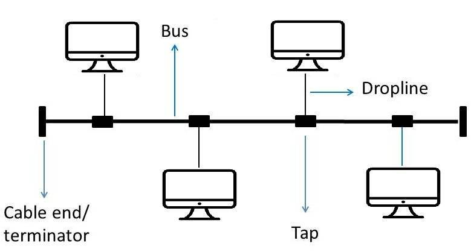
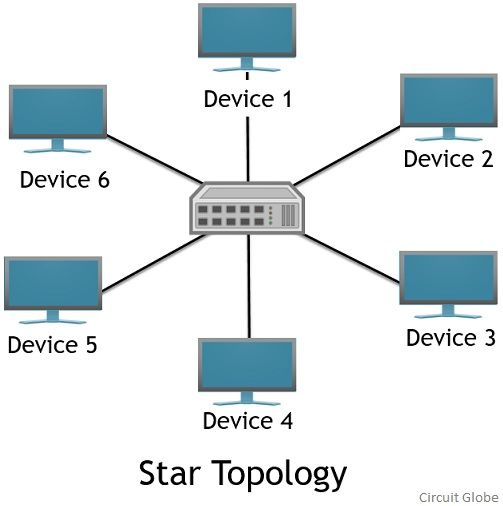
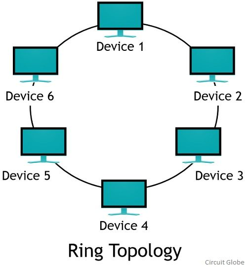

# Unit 1

## Goals of Computer Network

1. Cost Reduction
	* Cost is reduced as it uses same wire for telephone, television, and data
	* Cost of installation is reduced as it uses wireless communication
2. High Realibility 
	* Data transfer is reliable as it uses error checking and correction
	* System is less prone to failure as it has multiple paths for data transfer
3. High Flexiblity
	* It is easy to add new devices and connections
	* It is easy to make changes in the existing network
4. Powerfull communication Medium
	* It provides a medium for communication between two devices
	* It provides a medium for communication between two or more devices
5. Data Access is fast
	* Data transfer is fast due to the use of high-speed networks
	* Data transfer is fast due to the use of parallel processing

## Applications of CN

### Applications of CN

1. **Communication**
	* Communication through emails
	* Communication through chat applications
	* Communication through video conferencing
2. **Information Sharing**
	* Information sharing through File Transfer Protocol (FTP)
	* Information sharing through World Wide Web (WWW)
	* Information sharing through Peer-to-Peer (P2P) networks
3. **Entertainment**
	* Entertainment through online games
	* Entertainment through video streaming
	* Entertainment through music streaming

## Categories

### Local Area Network (LAN)

* It is a network that spans a small geographical area, typically a home, office building, or campus
* It is used to connect devices in a limited geographical area, such as a home, office building, or campus
* It is used to connect devices such as computers, printers, and servers
* It is used to provide access to shared resources such as files, printers, and internet
* It is used to provide a platform for communication and collaboration between devices and users

### Wide Area Network (WAN)

* It is a network that spans a large geographical area, typically a city, state, or country
* It is used to connect devices over a large geographical area, such as a city, state, or country
* It is used to connect devices such as computers, routers, and servers
* It is used to provide access to shared resources such as files, printers, and internet
* It is used to provide a platform for communication and collaboration between devices and users

### Metropolitan Area Network (MAN)

* It is a network that spans a metropolitan area, typically a city or town
* It is used to connect devices in a metropolitan area, such as a city or town
* It is used to connect devices such as computers, routers, and servers
* It is used to provide access to shared resources such as files, printers, and internet
* It is used to provide a platform for communication and collaboration between devices and users

### Personal Area Network (PAN)

* It is a network that spans a small area, typically a home, office or public hotspots
* It is used to connect devices in a limited area, such as a home, office or public hotspots
* It is used to connect devices such as computers, smartphones, and tablets
* It is used to provide access to shared resources such as files, printers, and internet
* It is used to provide a platform for communication and collaboration between devices and users

## Organization of Internet

* The internet is a network of networks, which means that it is a collection of many different networks, connected together
* The internet is managed by the Internet Corporation for Assigned Names and Numbers (ICANN)
* The internet is organized into different layers, each of which is responsible for a different aspect of the internet
* The layers are:
	+ Network Access Layer
	+ Internet Layer
	+ Transport Layer
	+ Application Layer

## ISP (Internet Service Provider)

* It is a company that provides internet access to individuals and organizations
* It provides internet access through dial-up, DSL, Cable, or Fiber Optics
* It provides internet access through different protocols such as TCP/IP, HTTP, FTP, and SMTP
* It provides internet access through different types of connections such as dial-up, broadband, and wireless

## Tier 1, Tier 2, Tier 3 ISP

* Tier 1 ISP:
	+ A Tier 1 ISP is a network that has a global presence and that peers with other Tier 1 networks
	+ It is considered a top-level ISP
	+ Examples of Tier 1 ISPs include AT&T, Verizon, and Level 3 Communications
* Tier 2 ISP:
	+ A Tier 2 ISP is a network that peers with Tier 1 networks, but that does not have a global presence
	+ It is considered a regional ISP
	+ Examples of Tier 2 ISPs include regional telephone companies and cable providers
* Tier 3 ISP:
	+ A Tier 3 ISP is a network that peers with Tier 2 networks, but that does not have a regional presence
	+ It is considered a local ISP
	+ Examples of Tier 3 ISPs include local internet service providers and small telephone companies

## Examples of ISP

* Google Fiber
* Verizon Fios
* Comcast Xfinity
* AT&T U-verse

## Data Communication

### What is Data Communication

* Data communication is the process of transferring data between two or more devices using a communication channel
* It is the process of sending and receiving data between two or more devices
* It is the process of exchanging data between two or more devices

### Duplex Mode

* In a duplex communication mode, data is transmitted in both directions, either simultaneously or in an alternating pattern
* There are three types of duplex modes:
	1. **Half Duplex Mode**: Data is transmitted in one direction at a time, with the direction of transmission being switched after each transmission
	2. **Full Duplex Mode**: Data is transmitted in both directions simultaneously, with data being transmitted in one direction while data is being received in the other direction
	3. **Simplex Mode**: Data is transmitted in one direction only, with data being transmitted from one device to another device without any data being transmitted back in the other direction

## Network architecture and Structure

### Network Architecture

* Network architecture is the design of a computer network, including the physical components and their relationships to each other
* It defines the structure and organization of a computer network
* It defines the protocols and standards used for communication between devices
* It defines the security measures used to protect the network from unauthorized access
* It defines the management and maintenance procedures used to keep the network running smoothly

### Peer to Peer (P2P)

* In a peer to peer network, each device is both a client and a server
* Each device is equal in the network and no device is more important than the other
* Data is transmitted between devices directly, without the need for a central server
* Each device is responsible for providing its own data and services to the network

Advantages:
* Scalability: P2P networks are highly scalable, as new devices can be easily added to the network
* Flexibility: P2P networks are highly flexible, as devices can be easily configured to act as both clients and servers
* Cost: P2P networks are cost-effective, as there is no need for a central server

Disadvantages:
* Security: P2P networks are vulnerable to security threats, as there is no central authority to manage the security of the network
* Performance: P2P networks can be slow, as data is transmitted directly between devices rather than through a central server
* Complexity: P2P networks can be difficult to manage and maintain, as there is no central authority to manage the network

### Client to Server (C2S)

* In a client to server network, devices are divided into two categories: clients and servers
* Clients are devices that request data and services from the server
* Servers are devices that provide data and services to the clients
* Data is transmitted between clients and servers, with the server being responsible for providing data and services to the clients

Advantages:
* Security: C2S networks are more secure, as there is a central authority (the server) that can manage the security of the network
* Performance: C2S networks are faster, as data is transmitted through a central server that can handle multiple requests simultaneously
* Ease of Management: C2S networks are easier to manage and maintain, as there is a central authority to manage the network

Disadvantages:
* Cost: C2S networks are more expensive, as there is a need for a central server that can handle multiple requests simultaneously
* Scalability: C2S networks are less scalable, as the central server can become overwhelmed if too many devices are added to the network
* Complexity: C2S networks can be more complex, as there is a need for a central server that can handle multiple requests simultaneously

## Layering

* Layering is the process of dividing a network into multiple layers, each of which is responsible for a different aspect of communication
* Layering is a key concept in computer networks, as it allows for the creation of a hierarchical, organized structure for communication
* Layering is based on the concept of abstraction, which allows for the creation of a simple, standardized interface for communication between devices

### Layering Principles

* Layering is based on the principles of modularity, scalability, and abstraction
* Modularity is the process of breaking a network into smaller, independent components that can be easily managed and maintained
* Scalability is the ability of a network to be expanded or modified without disrupting the existing network
* Abstraction is the process of hiding the details of a network from the user, allowing for a simpler, more standardized interface for communication

### Services Offered by Layers

* Each layer in a network offers a specific set of services to the layers above and below it
* The services offered by each layer are dependent on the specific layer and its responsibilities
* The services offered by each layer are as follows:

### Connection-Oriented and Connectionless

* Connection-Oriented:
	+ A connection is established between the sender and receiver before data is sent
	+ Data is sent in a sequence, with each packet being acknowledged by the receiver before the next packet is sent
	+ If a packet is lost or corrupted, it can be retransmitted
	+ Examples include TCP, HTTP, and FTP
* Connectionless:
	+ No connection is established between the sender and receiver before data is sent
	+ Data is sent without being acknowledged by the receiver
	+ If a packet is lost or corrupted, it is not retransmitted
	+ Examples include UDP, DNS, and DHCP

## OSI Reference Model

* The OSI (Open Systems Interconnection) reference model is a seven-layered hierarchical model for designing and implementing computer networks
* It is a conceptual framework for understanding how data is transmitted over a network
* It is a standardized model that is used to define the communication and networking process

### OSI Reference Model Layers

* Physical Layer (Layer 1):
	+ Defines the physical means of data transmission, such as electrical signals, light waves, or radio waves
	+ Specifies the physical components of a network, such as cables, routers, and switches
	+ Defines the data transmission rate, data transmission range, and data transmission protocol
* Data Link Layer (Layer 2):
	+ Provides error-free transfer of data frames between two devices on the same network
	+ Provides error detection and correction of data frames
	+ Provides flow control, which prevents the sender from sending data faster than the receiver can process it
* Network Layer (Layer 3):
	+ Provides routing of data between devices on different networks
	+ Provides logical addressing, which allows devices to be identified on a network
	+ Provides congestion control, which prevents network congestion by limiting the amount of data that can be sent
* Transport Layer (Layer 4):
	+ Provides reliable data transfer between devices on different networks
	+ Provides error detection and correction of data
	+ Provides flow control, which prevents the sender from sending data faster than the receiver can process it
* Session Layer (Layer 5):
	+ Establishes, maintains, and terminates connections between devices on different networks
	+ Provides synchronization of data transfer between devices
	+ Provides dialog control, which allows devices to communicate with each other
* Presentation Layer (Layer 6):
	+ Converts data into a format that can be understood by the receiving device
	+ Provides encryption and decryption of data
	+ Provides compression and decompression of data
* Application Layer (Layer 7):
	+ Provides services to end-user applications, such as email, file transfer, and web browsing
	+ Provides interfaces for applications to communicate with each other
	+ Provides support for functions such as email, file transfer, and web browsing

## TCP/IP Protocol Suite

* TCP/IP is a protocol suite for communication and data transfer over the internet
* It consists of four layers:
	+ Network Access Layer
	+ Internet Layer
	+ Transport Layer
	+ Application Layer

### TCP/IP Protocols

* IP (Internet Protocol):
	+ Provides logical addressing and routing of data between devices
* TCP (Transmission Control Protocol):
	+ Provides reliable data transfer with error detection and correction
	+ Provides flow control to prevent sender from sending data faster than receiver can process it
* UDP (User Datagram Protocol):
	+ Provides connectionless data transfer with error detection, but no correction
	+ Provides flow control to prevent sender from sending data faster than receiver can process it

### TCP/IP Layers

* Network Access Layer:
	+ Defines how data is transmitted and received over a physical network
	+ Specifies the physical components of a network, such as cables, routers, and switches
	+ Defines the data transmission rate, data transmission range, and data transmission protocol
* Internet Layer:
	+ Provides logical addressing and routing of data between devices
	+ Provides error detection and correction of data
	+ Provides congestion control, which prevents network congestion by limiting the amount of data that can be sent
* Transport Layer:
	+ Provides reliable data transfer between devices
	+ Provides error detection and correction of data
	+ Provides flow control, which prevents the sender from sending data faster than the receiver can process it
* Application Layer:
	+ Provides services to end-user applications, such as email, file transfer, and web browsing
	+ Provides interfaces for applications to communicate with each other
	+ Provides support for functions such as email, file transfer, and web browsing

## Network Devices and Components

* Network Devices:
	+ Hub:
		- A hub is a simple network device that connects multiple devices together
		- It is a multi-port repeater that forwards data to all connected devices
	+ Bridge:
		- A bridge is a network device that connects two or more networks together
		- It forwards data between networks based on MAC addresses
	+ Switch:
		- A switch is a network device that connects multiple devices together
		- It is a multi-port bridge that forwards data between devices based on MAC addresses
	+ Router:
		- A router is a network device that connects multiple networks together
		- It forwards data between networks based on IP addresses
	+ Wireless Access Point (WAP):
		- A WAP is a network device that connects wireless devices to a network
		- It forwards data between wireless devices and the network

## Physical Topology

* Physical topology refers to the physical layout of a network
* It defines how devices are connected to each other
* It can be classified into different types based on the physical layout of the network

### Bus Topology

* In a bus topology, all devices are connected to a single cable called a backbone
* The devices are connected to the backbone using drop lines
* Data is transmitted in one direction, either clockwise or counterclockwise
* If the backbone cable breaks, the entire network is disabled

### Ring Topology

* In a ring topology, devices are connected to each other in a circular configuration
* Data is transmitted in one direction, either clockwise or counterclockwise
* Each device acts as a repeater, amplifying the signal and passing it on to the next device
* If one device fails, the entire network is disabled

### Star Topology

* In a star topology, all devices are connected to a central device called a hub
* The hub acts as a repeater, amplifying the signal and passing it on to the other devices
* Data is transmitted in one direction, from the hub to the devices
* If the hub fails, the entire network is disabled

### Mesh Topology

* In a mesh topology, each device is connected to every other device
* Data can be transmitted directly between devices
* Each device acts as a repeater, amplifying the signal and passing it on to other devices
* If one device fails, the other devices can still communicate with each other

### Hybrid Topology

* Hybrid topology combines two or more different topologies
* Examples include a star-bus topology, which combines a star topology with a bus topology
* A tree topology, which combines a bus topology with a star topology

### Tree Topology

* In a tree topology, a central device is connected to multiple devices, which are connected to other devices
* Data is transmitted in one direction, from the central device to the peripheral devices
* If the central device fails, the entire network is disabled

## Transmission Media

* Transmission media refers to the physical path through which data is transmitted from one device to another
* It can be classified into two types: guided media and unguided media

### Guided Media

* Guided media uses a physical medium to transmit data
* Examples include twisted pair cables, coaxial cables, and fiber optic cables

### Unguided Media

* Unguided media uses no physical medium to transmit data
* Examples include radio waves, microwaves, and infrared light

### Types of Transmission Media

* Coaxial Cable:
	+ A coaxial cable consists of a central copper wire surrounded by insulation and a braided shield
	+ The central copper wire is the transmission medium
	+ The insulation and shield protect the central wire from electromagnetic interference
* Fiber Optic Cable:
	+ A fiber optic cable consists of a glass or plastic core surrounded by a cladding
	+ The core is the transmission medium
	+ Light is transmitted through the core, which is protected by the cladding
* Twisted Pair Cable:
	+ A twisted pair cable consists of two insulated copper wires twisted together
	+ The wires are the transmission medium
	+ The twisting and insulation protect the wires from electromagnetic interference

### Unguided Transmission

* Unguided transmission, also known as wireless transmission, is the transmission of data through the air (or space) without the use of a physical medium
* Examples include radio waves, microwaves, and infrared light
* It is used in wireless communication systems such as radio broadcasting, cellular networks, and satellite communication
* It is also used in wireless local area networks (WLANs) and wireless personal area networks (WPANs)

### Types of Unguided Transmission

* Radio Waves:
	+ Radio waves are a type of electromagnetic wave with a frequency lower than that of visible light
	+ They are used in radio broadcasting, cellular networks, and satellite communication
* Microwaves:
	+ Microwaves are a type of electromagnetic wave with a frequency higher than that of radio waves
	+ They are used in microwave ovens, satellite communication, and wireless local area networks (WLANs)
* Infrared Light:
	+ Infrared light is a type of electromagnetic wave with a frequency higher than that of microwaves
	+ It is used in remote controls, IrDA (infrared data association) communication, and night vision devices

### Digital to Digital Encoding

* Digital to digital encoding is the process of converting digital data into another form of digital data
* It is used in communication systems to ensure that data is transmitted accurately and efficiently
* It is used in digital communication systems such as computer networks, digital telephony, and digital radio
* Examples of digital to digital encoding include:
	+ Pulse Code Modulation (PCM):
		- PCM is a type of digital to digital encoding that converts analog signals into digital signals
		- It is used in digital telephony and in digital audio systems
	+ Delta Modulation (DM):
		- DM is a type of digital to digital encoding that converts digital signals into analog signals
		- It is used in digital telephony and in digital audio systems

### Terminology in Digital to Digital Encoding

* **Bit**: a single binary digit, which can have a value of either 0 or 1
* **Byte**: a group of 8 bits
* **Word**: a group of bits that are processed together, typically 16 or 32 bits
* **Nibble**: a group of 4 bits
* **Code**: a set of rules for converting data from one form to another
* **Encoder**: a device or program that converts data from one form to another
* **Decoder**: a device or program that converts data from one form back to its original form
* **Modulation**: the process of modifying a carrier signal to encode data onto it
* **Demodulation**: the process of extracting the original data from a modulated carrier signal
* **Bandwidth**: the range of frequencies that a signal can occupy
* **Channel**: a medium through which data is transmitted

### Signaling

* **Polar Encoding**: a type of digital to digital encoding that uses a single voltage level to represent data
	+ **Unipolar Encoding**: a type of polar encoding that uses a single voltage level to represent data
		- Only one voltage level is used to represent data
		- Example: Morse code
	+ **Bipolar Encoding**: a type of polar encoding that uses two voltage levels to represent data
		- Two voltage levels are used to represent data
		- Example: Pulse Code Modulation (PCM)
* **Return to Zero (RZ) Encoding**: a type of polar encoding that uses a single voltage level to represent data and returns to zero between each pulse
	+ **Differential Encoding**: a type of polar encoding that uses two voltage levels to represent data and the voltage levels are reversed between each pulse
		- The voltage levels are reversed between each pulse
		- Example: Differential Pulse Code Modulation (DPCM)
* **Manchester Encoding**: a type of polar encoding that uses two voltage levels to represent data and the voltage levels are reversed between each pulse
	+ **Differential Manchester Encoding**: a type of Manchester encoding that uses two voltage levels to represent data and the voltage levels are reversed between each pulse and the voltage levels are reversed between each pulse
		- The voltage levels are reversed between each pulse and the voltage levels are reversed between each pulse
		- Example: IEEE 802.3 Ethernet

### Network Performance

* **Bandwidth**: the maximum amount of data that can be transmitted in a given amount of time
* **Throughput**: the actual amount of data that is transmitted in a given amount of time
* **Latency**: the delay between the time data is sent and the time it is received
* **Jitter**: the variation in latency between multiple packets
* **Packet Loss**: the loss of data packets during transmission
* **Network Congestion**: a situation where the network is unable to handle the amount of data being transmitted
	+ **Congestion Control**: a technique used to prevent network congestion by limiting the amount of data that can be sent

### Transmission Impairment

* **Attenuation**: the loss of signal strength as data is transmitted over a medium
	+ **Attenuation Coefficient**: a measure of the amount of signal loss per unit distance
* **Distortion**: the alteration of the signal waveform as data is transmitted over a medium
	+ **Amplitude Distortion**: a type of distortion that affects the amplitude of the signal
	+ **Phase Distortion**: a type of distortion that affects the phase of the signal
	+ **Frequency Distortion**: a type of distortion that affects the frequency of the signal
* **Noise**: random variations in the signal that can cause errors in transmission
	+ **Thermal Noise**: a type of noise caused by the thermal motion of particles in the medium
	+ **Shot Noise**: a type of noise caused by the random fluctuations in the current flowing through the medium
	+ **Electromagnetic Interference (EMI)**: a type of noise caused by electromagnetic radiation from other sources
	+ **Cross Talk**: a type of noise caused by the electromagnetic radiation from other signals in the medium

### Switching Techniques

* **Circuit Switching**: a type of switching technique that sets up a dedicated communication path between two devices
	+ **Advantages**: dedicated communication path, low latency, high bandwidth
	+ **Disadvantages**: inefficient use of resources, difficult to manage
* **Packet Switching**: a type of switching technique that breaks data into small packets and transmits them over a network
	+ **Advantages**: efficient use of resources, easy to manage, scalable
	+ **Disadvantages**: higher latency, lower bandwidth
* **Message Switching**: a type of switching technique that transmits data as a single message
	+ **Advantages**: efficient use of resources, easy to manage
	+ **Disadvantages**: higher latency, lower bandwidth

### Circuit Switching

* **Circuit Switching Network**: a network that uses circuit switching to transmit data
	+ **Switching Node**: a device that forwards data between two or more networks
	+ **Circuit**: a dedicated communication path that is established between two devices
* **Circuit Switching Process**:
	1. **Call Setup**: the process of setting up a dedicated communication path between two devices
	2. **Data Transfer**: the process of transmitting data over the dedicated communication path
	3. **Call Teardown**: the process of tearing down the dedicated communication path after data transfer is complete

### Packet Switching

* **Packet Switching Network**: a network that uses packet switching to transmit data
	+ **Router**: a device that forwards packets between two or more networks
	+ **Packet**: a small block of data that is transmitted over a network
* **Packet Switching Process**:
	1. **Packetization**: the process of breaking data into small packets
	2. **Packet Forwarding**: the process of forwarding packets between two or more networks
	3. **Packet Reassembly**: the process of reassembling packets into the original data

### Multiplexing

* **Multiplexing**: the process of combining multiple signals into a single signal
	+ **Frequency Division Multiplexing (FDM)**: a type of multiplexing that divides a signal into multiple frequency bands
		- **Advantages**: high bandwidth, low latency
		- **Disadvantages**: difficult to manage, requires a lot of bandwidth
	+ **Time Division Multiplexing (TDM)**: a type of multiplexing that divides a signal into multiple time slots
		- **Advantages**: easy to manage, scalable
		- **Disadvantages**: higher latency, lower bandwidth
	+ **Code Division Multiplexing (CDM)**: a type of multiplexing that uses different codes to represent different signals
		- **Advantages**: high bandwidth, low latency, scalable
		- **Disadvantages**: difficult to manage, requires a lot of bandwidth

### Multiplexing Features

* **Multiplexing Features**:
	+ **Statistical Multiplexing**: a type of multiplexing that assigns different amounts of bandwidth to different signals based on demand
		- **Advantages**: efficient use of resources, scalable
		- **Disadvantages**: difficult to manage, requires a lot of bandwidth
	+ **Asynchronous Multiplexing**: a type of multiplexing that assigns different amounts of bandwidth to different signals based on demand and allows for the transmission of data at different rates
		- **Advantages**: efficient use of resources, scalable, allows for the transmission of data at different rates
		- **Disadvantages**: difficult to manage, requires a lot of bandwidth

### Multiplexing Advantages

* **Multiplexing Advantages**:
	+ **Efficient Use of Resources**: multiplexing allows for the efficient use of resources by allowing multiple signals to be transmitted over the same medium
	+ **Scalability**: multiplexing allows for the transmission of data at different rates and allows for the addition of new signals to the multiplexed signal
	+ **Low Latency**: multiplexing allows for low latency transmission of data by allowing for the transmission of data at different rates

### Multiplexing Disadvantages

* **Multiplexing Disadvantages**:
	+ **Difficult to Manage**: multiplexing can be difficult to manage, as it requires the allocation of bandwidth to different signals
	+ **Requires a Lot of Bandwidth**: multiplexing requires a lot of bandwidth, as it requires the transmission of multiple signals over the same medium
