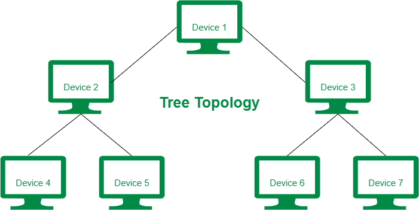
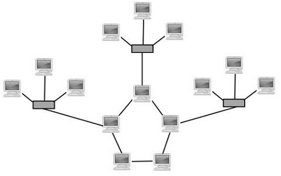
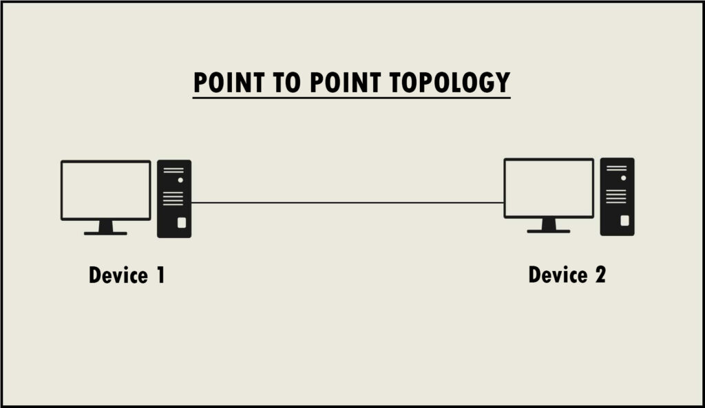
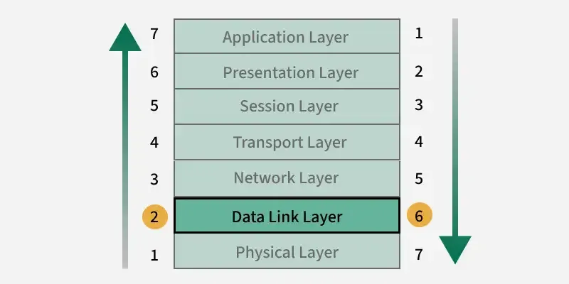

## 🧱 **1. Physical Layer** (Transmission Media, Network Topology Design)

### 🧩 Physical Layer kya hota hai?

Physical Layer sabse **lowest layer** hoti hai OSI model mein. Ye layer sirf **bits (0 aur 1)** ko physically transmit karne ke liye responsible hoti hai — chahe wire ke through ho ya wireless.

Socho aap kisi ko paighaam bhejna chahte ho — par aapko **us paighaam ko physically kaise bhejna hai**, ye decide karna is layer ka kaam hai.

---

### 📡 Transmission Media

Transmission Media do tarah ke hote hain:

#### A. **Guided Media** (Wired)

Yaha signals ek **physical path** (wire, cable) follow karte hain.

##### Examples:

* **Twisted Pair Cable** – jaise telephone wires.

* **Coaxial Cable** – TV connection cable.

* **Optical Fiber Cable** – super fast internet, light pulses ka use hota hai.

🧠 **Metaphor**: Guided media aise hai jaise ek pipe jisme paani flow karta hai — paani (data) ek fixed path follow karta hai.

#### B. **Unguided Media** (Wireless)

Yaha signals bina kisi wire ke air mein travel karte hain — jaise radio waves.

##### Examples:

* **Radio Waves** – FM, walkie-talkie.
* **Microwaves** – satellite communication.
* **Infrared** – TV remote.

🧠 **Metaphor**: Unguided media aise hai jaise hawa mein chhoda gaya patang — koi fixed rasta nahi, lekin goal ek hi hai: destination tak pahuchna.

---

### 🕸️ Network Topology Design

Ye define karta hai ki **devices (nodes)** ka arrangement network mein kaise hai. Socho aapke ghar mein sab devices ek doosre se kaise connected hain.

#### Types of Topologies:

1. **Bus Topology** – ek single line hai jisme sab devices connected hain.

   * Example: School van – sab bacche ek hi route mein baithte hain.

2. **Star Topology** – sab devices ek central hub se jude hote hain.

   * Example: Hub ke around ghoomta hua chowk – sab raste ek hi point se nikalte hain.

3. **Ring Topology** – circular connection hoti hai.

   * Example: Railway circular route.

4. **Mesh Topology** – har device har doosre device se directly connected hoti hai.

   * Example: WhatsApp group jaha har koi sabko message kar sakta hai.

## 🔄 5. **Tree Topology** (Hierarchical Topology)

### 📘 Explanation:

Ye ek combination hoti hai **Star aur Bus topology** ka. Devices ek hierarchical (layered) structure mein connected hote hain — jaise ek tree ki branches.

### 🌳 Example:

School ka hierarchy:

* Principal (root)
* Teachers (branches)
* Students (leaves)

### ✔️ Pros:

* Scalable (easily expand ho sakta hai)
* Troubleshooting easy

### ❌ Cons:

* Root failure = poora system down

📷 (Tree Topology Image Suggestion: Ek tree jisme root se branches nikal rahe ho aur har branch ke aage devices lage ho.)

---

## 💥 6. **Hybrid Topology**

### 📘 Explanation:

Jab do ya zyada topologies ko combine kiya jata hai to usse **Hybrid Topology** kehte hain.

### 🌐 Example:

Ek company jisme kuch departments **star** topology mein hain, kuch **ring** mein — aur inhe connect kiya gaya hai bus se. Poora system milke ek hybrid ban gaya.

### ✔️ Pros:

* Flexible and customizable
* Large-scale networks ke liye perfect

### ❌ Cons:

* Complex design
* Expensive to maintain

📷 (Hybrid Topology Image Suggestion: Multiple topologies ek diagram mein combined ho.)

---

## 🛰️ 7. **Point-to-Point Topology**

### 📘 Explanation:

Sirf **do devices** ke beech direct communication hota hai — bilkul ek **dedicated line** ke through.

### 🔗 Example:

Walkie-talkie between two soldiers — sirf dono ke beech baat ho rahi hai, koi third party nahi.

### ✔️ Pros:

* High speed and reliable
* Secure communication

### ❌ Cons:

* Limited to only two devices

---

## ✅ Summary Table of All Topologies:

| Topology           | Structure                     | Metaphor Example      |
| ------------------ | ----------------------------- | --------------------- |
| **Bus**            | Single line                   | School van route      |
| **Star**           | Central hub                   | Chowk ke around raste |
| **Ring**           | Circular connection           | Circular railway      |
| **Mesh**           | Every node connected to every | WhatsApp group        |
| **Tree**           | Hierarchical (Star + Bus)     | School structure      |
| **Hybrid**         | Mix of multiple topologies    | Mixed infrastructure  |
| **Point-to-Point** | Direct link between 2 nodes   | Walkie-talkie         |
| **Daisy Chain**    | Sequential device connection  | Phoolon ki mala       |

---

---

## 🧾 **2. Data Link Layer**

### 🎯 Objective:

* Bit ko **frame** mein convert karna
* Errors detect/correct karna
* Flow control karna
* Reliable data transfer ensure karna

---

### 🔒 Framing

Bits ko samajhne ke liye hume unko **frames** mein divide karna padta hai — jaise ek kitaab ke chapters.

#### Example:

Aap ek line bolte ho: *"Mujhe paani chahiye."*
Receiver ko pata kaise chale ki message yahi khatam hua? Uske liye hum starting aur ending markers daalte hain.

Methods:

* **Character Count**
* **Flag Bits (HDLC uses this)**
* **Bit Stuffing**

---

### ❗ Error Detection & Correction

Jab data transmit hota hai to beech mein **noise** ki wajah se galti ho sakti hai.

#### Example:

"Aapne bola 1010, lekin receiver ko mila 1110."

#### Techniques:

* **Parity Bit** – odd ya even number of 1s check karo.
* **Checksum** – total sum ka verification.
* **CRC (Cyclic Redundancy Check)** – polynomial division pe based hoti hai.
* **Hamming Code** – error detect + correct dono karta hai.

---

### 🔄 Flow Control

Flow control ensure karta hai ki sender itna fast data na bheje ki receiver usko process hi na kar paye.

#### Example:

Aap tea bana rahe ho, par guest tea zyada pee nahi sakte. To aap dhire-dhire pilate ho — yehi flow control hai.

Techniques:

* **Stop-and-Wait**
* **Sliding Window**

---

### 📉 Error Control

Error control ensure karta hai ki agar koi data corrupt ya miss ho gaya ho to usse dobara bheja jaaye.

---

### 🚫 Noiseless & Noisy Channel Protocols

#### A. **Noiseless Channel**

Yaha assume kiya jaata hai ki data bina kisi error ke transmit hota hai.

* **Simplest Protocol**
* **Stop-and-Wait Protocol**

#### B. **Noisy Channel**

Yaha assume kiya jaata hai ki transmission mein error ho sakti hai.

* **Automatic Repeat Request (ARQ)**

  * **Stop-and-Wait ARQ**
  * **Go-Back-N ARQ**
  * **Selective Repeat ARQ**

---

### 🛰️ HDLC (High-Level Data Link Control)

HDLC ek **bit-oriented protocol** hai jo reliable data transfer ensure karta hai.

**Frame Types:**

1. **I-frame (Information)**
2. **S-frame (Supervisory)**
3. **U-frame (Unnumbered)**

**Uses:**

* WANs
* Point-to-Point connections

🧠 HDLC ka frame flag hota hai `01111110` — special sequence jisse pata chalta hai frame kaha start/end hota hai.

---

### 🔗 PPP (Point-to-Point Protocol)

PPP mainly **internet connection over dial-up** ya **DSL** ke liye use hota tha.

**Features:**

* Authentication support
* Error detection
* Can carry multiple protocols (IP, IPX)

🧠 Socho PPP ek auto-rickshaw hai jo 1 passenger (protocol) ko le jaata hai ek point se doosre point par.

---

## ✅ Summary Table:

| Topic                    | Hindi/Metaphor Description                |
| ------------------------ | ----------------------------------------- |
| Physical Layer           | Data ki delivery wire/air ke zariye       |
| Guided Media             | Wires (TV, Telephone)                     |
| Unguided Media           | Wireless (FM, WiFi)                       |
| Network Topology         | Devices ka connection layout              |
| Framing                  | Bits ko proper format mein divide karna   |
| Error Detection          | Galti pakadna (Parity, CRC)               |
| Error Correction         | Galti sudharna (Hamming Code)             |
| Flow Control             | Speed control between sender and receiver |
| Noisy/Noiseless Channels | Error hone wale aur error-free channels   |
| HDLC                     | Advanced reliable data transfer protocol  |
| PPP                      | Point-to-point reliable dial-up protocol  |

---

