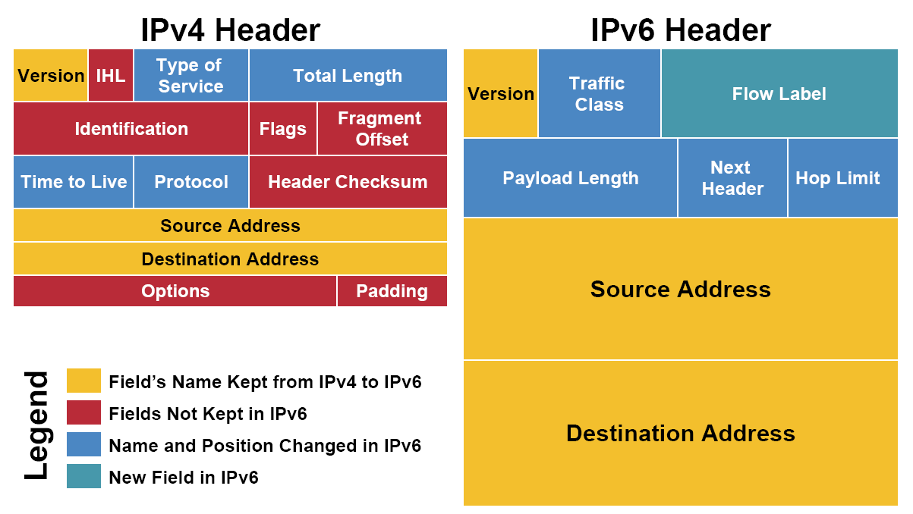
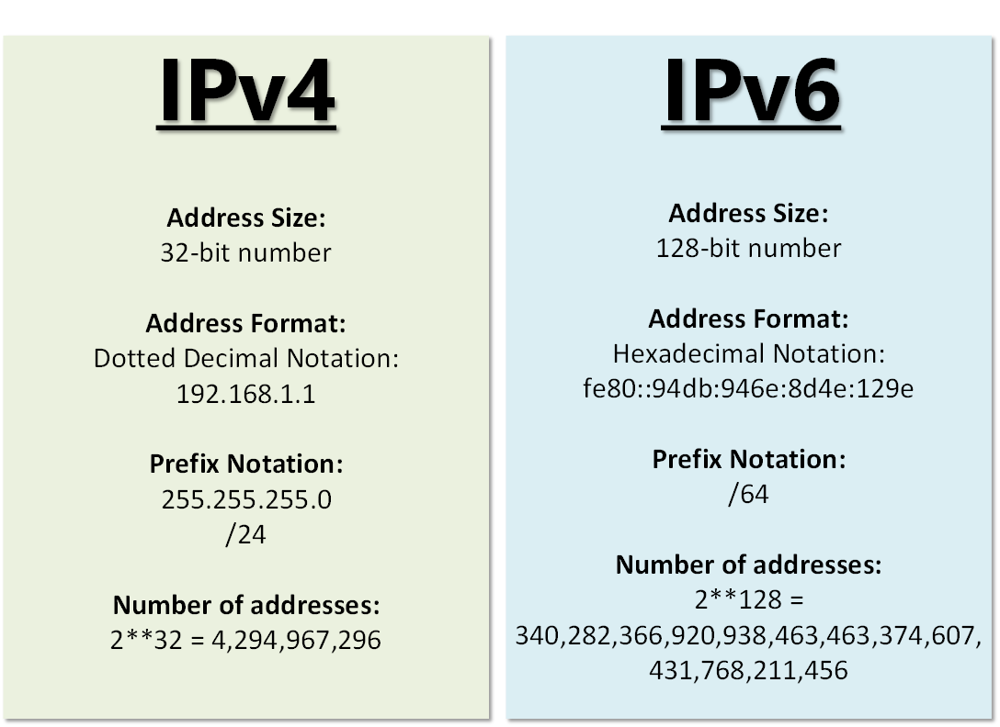
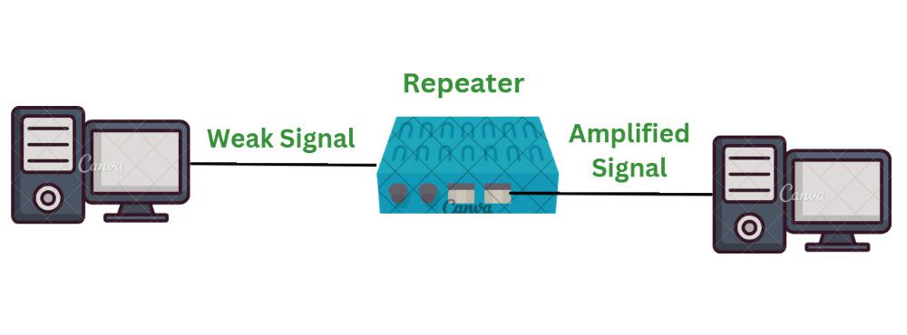
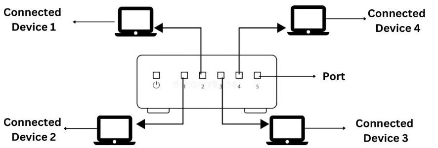
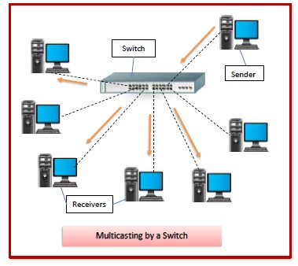
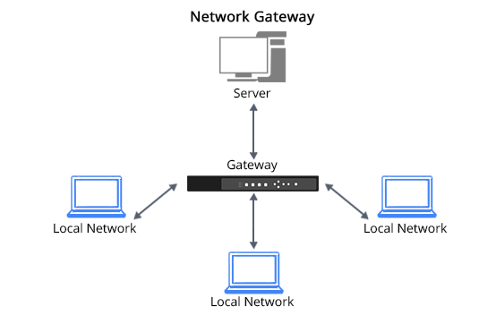

# 📘 1. **Network Layer: Design Issues**

### 📌 Network Layer kya karta hai?

Network layer ka kaam hota hai:

* Data ko source (bhejne wale) se destination (paane wale) tak pahuchana
* **Route dhoondhna**
* **Error handle karna**
* **Traffic control karna**

Soch lo ki **Network Layer = Delivery Company** jaise Bluedart ya Amazon Delivery.

---

### ⚙️ Important Design Issues:

#### 1. **Service to Transport Layer**

* Network Layer, Transport Layer ko 2 types ki services de sakta hai:

  * **Connectionless Service:**
    Jaise **postcard** – directly daal diya letterbox me. Pahucha ya nahi, pata nahi.
  * **Connection-oriented Service:**
    Jaise **courier service** – tracking, signed delivery. Safe aur reliable.

#### 2. **Packetizing of Data**

* Data ko chhote-chhote pieces me todna padta hai – isse kehte hain **packets**.
* Jaise ek badi book ko chapters me divide karke bhejna.

#### 3. **Routing**

* Packet ko **best path** se bhejna.
* Jaise GPS shortest route batata hai, waise hi Network Layer best route choose karti hai.

#### 4. **Error Handling**

* Agar koi packet corrupt ho gaya ya gum ho gaya, to usse handle karna.

#### 5. **Congestion Control**

* Jab network me zyada data aa jaye (traffic jam), to speed slow ho jati hai.
* Network Layer ko congestion se bachna hota hai.

---

# 🚦 2. **Routing Algorithms**

### 📌 Routing kya hota hai?

* **Routing = Best raasta dhoondhna** jahan se packet destination tak ja sake.

Jaise aapko Delhi se Mumbai jaana hai to aap NH48 choose karte ho – shortest aur fastest route.

---

### 🚧 Routing ke Do Main Types:

#### 1. **Static Routing**

* Routes manually set hote hain. Change nahi hote.
* Example: Har baar ek hi raaste se office jaana.

#### 2. **Dynamic Routing**

* Routes automatically update hote hain.
* Jaise Google Maps traffic ke hisaab se route badal deta hai.

---

### 🧠 Important Routing Algorithms:

#### A. **Distance Vector Routing**

* Har router apne neighbor se poochta hai ki “tumhare paas shortest path kaunsa hai?”
* Sab ek-do hop ka distance jaante hain, aur gradually pura network ka idea banate hain.
* Example: Ghar se puchna – “Nukkad ki medical shop kaha hai?”

#### B. **Link State Routing**

* Har router pura network map banata hai.
* Apne link ki speed aur quality measure karta hai.
* Example: Traffic app jo har road ka condition check karta hai.

#### C. **Hierarchical Routing**

* Bade networks ko regions me divide karte hain.
* Har level pe router hota hai – jaise Company me CEO > Manager > Team Lead.

---

# 🛑 3. **Congestion Control Algorithms**

### 📌 Congestion kya hota hai?

* Jab network me zyada packets bhej diye jaate hain aur routers process nahi kar paate.
* Result: Delay, Packet Loss, Network Down.

Socho road pe itni saari gaadiyan aa gayi ki sab slow ho gayi.

---

### ⚙️ Congestion Control ke Algorithms:

#### A. **Leaky Bucket Algorithm**

* Ek bucket hai jisme paani (data) girta hai, aur neeche ek hole se slowly nikalta hai.
* Agar zyada paani aa gaya to overflow ho gaya.
* Use: Network me ek regular speed maintain karne ke liye.

📦 **Example:**

* Imagine karo aap ke paas ek bottle hai jisme sirf thoda-thoda paani nikalta hai.
* Agar aap pura jug daaloge to overflow ho jayega.

#### B. **Token Bucket Algorithm**

* Har second ek token milta hai.
* Sirf token ke sath hi data bhej sakte ho.
* Burst data bhejna bhi allowed hai agar tokens bache hain.

📦 **Example:**

* Like movie tickets – agar paas me token hai to hi andar ja sakte ho.

#### C. **Traffic Shaping**

* Data ko control karke bhejna – jaise speed breaker traffic ko slow karta hai.

#### D. **Admission Control**

* Network pe naye packets ka entry band kar dena jab already traffic zyada ho.

---

## ✅ Recap Table (Super Quick Summary)

| Topic              | Summary                              | Example/Metaphor |
| ------------------ | ------------------------------------ | ---------------- |
| Design Issues      | Packets, Routing, Errors, Congestion | Courier Service  |
| Routing Algorithms | Best Path Finder                     | Google Maps      |
| Congestion Control | Network Traffic Handling             | Road Jam Control |

---

## 🌐 **1. Internetworking**

### 📌 What is Internetworking?

**Internetworking** ka matlab hota hai **do ya zyada networks ko jodna** taaki wo aapas me data exchange kar saken — chahe unka structure, type, ya technology alag ho.

🧠 **Simple Metaphor:**

> Sochiye alag-alag ghar (LAN networks) hain, aur aap unko road, phone line, aur courier system ke through jodte ho – taaki sab ek doosre se baat kar sakein. Yehi Internetworking hai.

---

### 📦 Example:

* Aapke ghar ka WiFi (LAN) jab internet (WAN) se connect hota hai, to wo Internetworking ka example hai.
* School network + College network + Office network = Internet (Sabka Internetworking)

---

## 🧱 **2. TCP/IP Model**

### 🔍 TCP/IP kya hai?

TCP/IP ka full form hai:
**Transmission Control Protocol / Internet Protocol**

Ye **communication protocol suite** hai, jiske through internet par data bhejna possible hota hai.

### 📶 Layers of TCP/IP Model:

TCP/IP model ke **4 layers** hote hain (OSI model ke 7 layers ka simplified version):

| TCP/IP Layer         | OSI Equivalent           | Explanation                          |
| -------------------- | ------------------------ | ------------------------------------ |
| 1. Application Layer | App/Presentation/Session | User ke software jaise Chrome, Gmail |
| 2. Transport Layer   | Transport                | End-to-end connection, e.g., TCP/UDP |
| 3. Internet Layer    | Network                  | Logical addressing, e.g., IP         |
| 4. Network Access    | Data + Physical          | Physical transmission                |

---

### 🔁 TCP vs IP:

#### ✅ **TCP (Transmission Control Protocol):**

* Reliable communication
* Data ko packets me todta hai aur receive hone ke baad unko jodta hai.
* **Jaise ek courier service with tracking.**

#### ✅ **IP (Internet Protocol):**

* Addressing aur routing karta hai.
* Har device ko IP address deta hai jisse wo identify hota hai.
* **Jaise ghar ka address bina naam ke courier pahuch jaye.**

---

## 📦 **3. IP Packet**

### 📌 IP Packet kya hota hai?

* Jab koi data (jaise WhatsApp message) internet pe bhejte hain, to wo data chhote-chhote **packets** me tod diya jata hai.
* Har packet me hota hai:

  * **Header** (Information like source IP, destination IP)
  * **Payload** (actual data – jaise aapka message/image)

🧠 **Metaphor:**

> Jaise ek badi book ko courier karna ho, to usse 4-5 small parcels me divide kar dete ho. Har parcel pe likha hota hai: "Parcel 1 of 5", "Parcel 2 of 5", etc.

---

### 🔎 Structure of IP Packet:

| Section     | Explanation                                                      |
| ----------- | ---------------------------------------------------------------- |
| **Header**  | Source & Destination IP, version (IPv4/IPv6), time-to-live, etc. |
| **Payload** | Actual data (jaise WhatsApp msg, photo, email etc.)              |

---

### ✅ Example:

Aapne YouTube pe video play kiya:

* Video ka data chhote packets me divide ho gaya
* Har packet me IP Header hai (kaun bhej raha hai, kahan bhejna hai)
* Ye packets network se travel karte hain
* Destination pe pahuch kar dubara assemble ho jate hain

---

## 🔁 Real-Life Summary:

| Concept         | Real-Life Metaphor                                                  |
| --------------- | ------------------------------------------------------------------- |
| Internetworking | Ghar, office aur schools ke network ko ek internet highway se jodna |
| TCP             | Reliable courier service – ensures delivery                         |
| IP              | Address system – kis ghar me parcel bhejna hai                      |
| IP Packet       | Chhoti chhoti parcel pieces – har ek me thoda data aur address      |

---

## 🌍 1. **IPv4 and IPv6 Protocols**

### 📌 Pehle samjhte hain: **IP Protocol kya hai?**

**IP (Internet Protocol)** ka kaam hai:

* Har device ko **ek unique address** dena
* Data packets ko **source se destination** tak pahunchana

Sochiye aapko kisi ko courier bhejna hai, to uska **ghar ka exact address** chahiye. IP address wahi address hota hai, lekin **internet ke liye**.

---

## 🧮 IPv4 (Internet Protocol version 4)

### 🔢 IPv4 Address Format:

* 32-bit address
* Total approx **4.3 billion unique addresses**
* Format: `xxx.xxx.xxx.xxx` (har part 0 se 255 ke beech)
* Example: `192.168.1.1`

### 📦 Example:

* Ghar me WiFi router ka address ho sakta hai: `192.168.0.1`
* Har phone/laptop ko router ek naya IPv4 address deta hai: `192.168.0.2`, `192.168.0.3`, etc.

---

### ❌ IPv4 ki Limitations:

* Sirf 4.3 billion addresses – duniya me devices zyada ho gaye hain (smartphones, laptops, TVs, etc.)
* Isliye naye addresses chahiye the → **IPv6 introduce hua**

---

## 🔢 IPv6 (Internet Protocol version 6)

### 🔢 IPv6 Address Format:

* 128-bit address
* **340 undecillion** addresses (literally unlimited)
* Format: Hexadecimal + colons
* Example:
  `2001:0db8:85a3:0000:0000:8a2e:0370:7334`

### ✅ IPv6 ke Advantages:

1. **Zyada addresses** – future ke liye perfect
2. **Security built-in** – IPsec jaisa encryption support
3. **No NAT needed** – har device globally unique ho sakta hai
4. **Faster routing** – modern design

---

### 🧠 Metaphor: IPv4 vs IPv6

| Feature         | IPv4                        | IPv6                             |
| --------------- | --------------------------- | -------------------------------- |
| Bit Length      | 32-bit                      | 128-bit                          |
| Address Format  | `192.168.1.1`               | `2001:0db8:85a3::8a2e:0370:7334` |
| Total Addresses | \~4.3 billion               | 340 undecillion+                 |
| Example Use     | Home WiFi, LAN, old devices | New internet, smart cities, IoT  |

🧠 **Soch lo IPv4 = Gaon ka address system**, limited jagah
🧠 **IPv6 = Sheher ka address system**, infinite buildings, floors, flat numbers

---

## 📌 2. **IPv4 Addressing – Types & Details**

### IPv4 address 4 parts me banta hai:

`A.B.C.D` — har part 0 to 255 ke beech

Example: `192.168.10.4`

---

### ✅ IPv4 Address ke **Types:**

#### 1. **Unicast**

* Ek device se ek hi specific device ko message
* Example: Aapka phone -> Server ko WhatsApp msg

#### 2. **Broadcast**

* Ek device se **sabhi devices** ko message
* Example: Network pe sabhi computers ko alert bhejna

#### 3. **Multicast**

* Ek device se **selected group** ko message
* Example: Teacher Zoom class me sirf batch A ko message bheje

---

### ✅ IPv4 Address Classes:

| Class | Range                       | Use                 |
| ----- | --------------------------- | ------------------- |
| A     | 1.0.0.0 – 126.255.255.255   | Very large networks |
| B     | 128.0.0.0 – 191.255.255.255 | Medium networks     |
| C     | 192.0.0.0 – 223.255.255.255 | Small networks      |
| D     | 224.0.0.0 – 239.255.255.255 | Multicast groups    |
| E     | 240.0.0.0 – 255.255.255.255 | Research (reserved) |

---

### 🔐 Private IP Address Ranges (LAN ke liye):

| Class | Range Example                 |
| ----- | ----------------------------- |
| A     | 10.0.0.0 – 10.255.255.255     |
| B     | 172.16.0.0 – 172.31.255.255   |
| C     | 192.168.0.0 – 192.168.255.255 |

Yeh addresses **internet pe directly nahi jaate**, sirf ghar/office ke internal network me use hote hain.

---

## 🧾 Final Recap Chart:

| Feature          | IPv4                          | IPv6                               |
| ---------------- | ----------------------------- | ---------------------------------- |
| Bit Size         | 32-bit                        | 128-bit                            |
| Address Format   | `192.168.1.1`                 | `2001:0db8::1`                     |
| Total Addresses  | \~4.3 Billion                 | Almost Unlimited                   |
| Types            | Unicast, Broadcast, Multicast | Unicast, Multicast, Anycast        |
| Speed & Security | Basic                         | Faster + More Secure               |
| Use Case         | Old networks, LAN             | Modern networks, IoT, future-ready |

--- 

## 🔌 1. **Connecting Devices** (Network Devices)

Ye devices **do ya zyada computers/networks** ko jodne ka kaam karte hain. Sochiye ye **traffic police ya signal** jaise kaam karte hain — decide karte hain data kahan se kahan jana chahiye.

### 📦 Types of Connecting Devices:

---

### 🔁 A. **Repeater**

* Signal ko **boost** karta hai.
* Jab signal weak ho jata hai (jaise door tak travel karke), repeater usse refresh karta hai.

🧠 **Metaphor:**
Jaise koi shout kar raha ho aur koi beach me repeat karke agli line tak pahucha raha ho.

---

### 🔗 B. **Hub**

* Sabhi devices se data leta hai aur **har port** pe bhejta hai.
* Intelligent nahi hota. Kisi bhi device ko specifically data nahi bhejta.

🧠 **Example:**
Classroom me teacher ek line sab students ko bol de – chahe kisi ko zarurat ho ya na ho.

---

### 🔀 C. **Switch**

* Intelligent hub jaisa hota hai.
* Sirf usi device ko data bhejta hai jisko zarurat hai.

🧠 **Example:**
Teacher sirf usi student ko answer de jise usne question poocha hai.

---

### 🌐 D. **Router**

* **Alag-alag networks** ko connect karta hai.
* Internet use karne ke liye router zaruri hota hai.
* IP address ka use karke path choose karta hai.

🧠 **Example:**
Google Maps jaisa device jo best route decide karta hai – ghar se office tak.

---

### 🔄 E. **Gateway**

* **Alag protocols** ke beech translation karta hai.
* Jaise ek English bolne wale aur Hindi bolne wale ke beech translator.

🧠 **Example:**
Bank ATM system jo banking software se alag network pe kaam karta hai.

---

## 🧱 2. **Virtual LAN (VLAN)**

### 📌 VLAN kya hota hai?

**VLAN = Virtual Local Area Network**

Yeh **logical group** banata hai same ya alag physical location ke computers ka — taaki wo **ek hi network jaise kaam karein**.

🧠 **Example:**
Socho ek school me:

* Class 10A ke students alag rooms me baithe hain
* Lekin teacher ne un sabko ek WhatsApp group me daal diya ho
* Toh wo group = VLAN (ek logical connection)

---

### ✅ VLAN ke Benefits:

| Benefit             | Explanation                                        |
| ------------------- | -------------------------------------------------- |
| 🎯 Security         | Unwanted traffic se alag rakh sakte ho users ko    |
| 🚀 Efficiency       | Traffic kam hota hai, speed zyada hoti hai         |
| 🧩 Flexibility      | Alag-alag jagah ke log ek hi VLAN me ho sakte hain |
| 🛠️ Easy Management | Network organize karna simple ho jata hai          |

---

### 📦 VLAN Example:

* Admins ke systems: VLAN 10
* Students ke systems: VLAN 20
* Teachers ke systems: VLAN 30

> Sab alag VLAN me hain, alag traffic, secure and fast.

---

## 🌐 3. **IPv6 Addresses**

### 📌 IPv6 = Next generation Internet addressing system

128-bit address hota hai (IPv4 me sirf 32-bit)

Format:
`2001:0db8:85a3:0000:0000:8a2e:0370:7334`

---

### 🔎 Types of IPv6 Addresses:

#### ✅ 1. **Unicast**

* One-to-one communication
* Ek sender, ek receiver

🧠 **Example:**
Aapne kisi friend ko Instagram message bheja

---

#### 🟡 2. **Multicast**

* One-to-many communication
* Ek sender, selected group receivers

🧠 **Example:**
Teacher ne sirf 10A group ko Zoom link bheja

---

#### 🔵 3. **Anycast**

* One-to-nearest-one communication
* Ek address, multiple receivers — jo **nearest** hoga, wahi response karega

🧠 **Example:**
Google ke 100 servers hain – aap request bhejte ho, jo server aapke sabse kareeb hoga, wo respond karega

---

### ⚙️ IPv6 Features Recap:

| Feature         | IPv6 Highlights                          |
| --------------- | ---------------------------------------- |
| Length          | 128-bit                                  |
| Format          | Hexadecimal                              |
| Types           | Unicast, Multicast, Anycast              |
| Use             | Future-ready networks, IoT, smart cities |
| Address Example | `2001:db8::1`                            |

---

## ✅ Final Summary Chart

| Topic                  | Key Points (Simple)                                                             |
| ---------------------- | ------------------------------------------------------------------------------- |
| **Connecting Devices** | Repeater, Hub, Switch, Router, Gateway — each has a role in data movement       |
| **VLAN**               | Logical network banata hai; security, speed, and organization better hota hai   |
| **IPv6 Addresses**     | Unlimited addresses, 3 types (Unicast, Multicast, Anycast), future-proof system |

---

