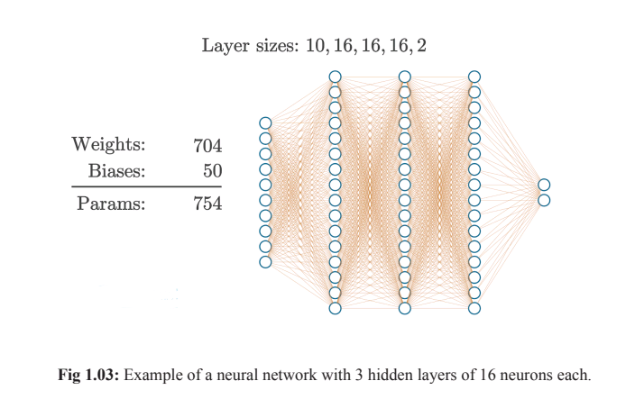
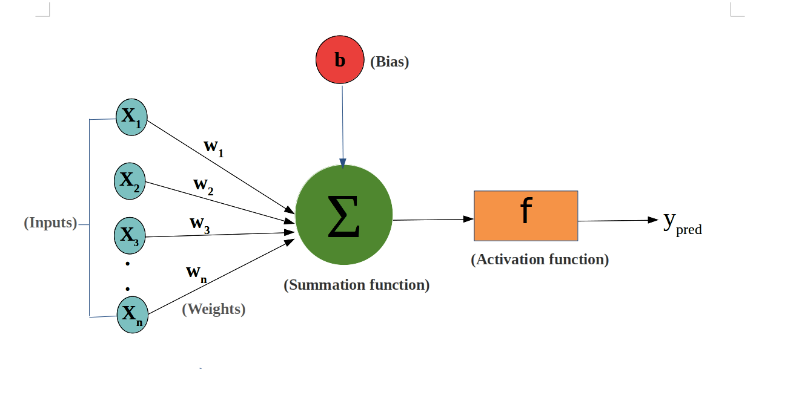

## 🔶 Part 1: Multi-Layer Perceptron (MLP)

### 💡 **Definition:**

Multi-Layer Perceptron ek aisa neural network hota hai jo **multiple layers of neurons** se bana hota hai — **Input layer, Hidden layer(s), aur Output layer**. Ye ek feed-forward neural network hota hai, jisme data ek direction mein flow karta hai.

---





**Explanation:**

* **Input Layer:** Ye wo layer hai jahan humara raw data enter karta hai. Jaise kisi student ke marks: \[x1 = maths, x2 = science, x3 = english, x4 = history].
* **Hidden Layer:** Yahan calculations hoti hain. Ye neurons inputs ko process karke hidden features nikalte hain.
* **Output Layer:** Final prediction ya result milta hai. Jaise: "Pass" ya "Fail".

---

## 🔶 Part 2: Working of a Perceptron (Step-by-Step)

Ek perceptron ka kaam hota hai input data ko lekar uska prediction karna using some rules. Ye kaam hota hai 5 major steps mein:

---

### 🔹 1. **Neurons and Weights**

* **Neuron (Node):** Ek chhota processing unit jo ek signal (input) leta hai, uspar calculation karta hai aur aage pass karta hai.
* **Weights (W):** Ye ek number hota hai jo batata hai ki input kitna important hai.

**Example:**
Maan lijiye aapke paas ek input hai: `x = 2`, aur uska weight hai `w = 0.5`. To:

```
weighted_input = x * w = 2 * 0.5 = 1
```

Jaise agar ek teacher ko science ke marks zyada important lagte hain, to uska weight zyada hoga.

---

### 🔹 2. **Activation Function**

* Activation function decide karta hai ki output aage bhejna hai ya nahi. Ye input ko process karke decide karta hai—on/off, yes/no, 0/1.

**Common functions:**

* Sigmoid → Output between 0 and 1
* ReLU → Removes negative values (output = max(0, x))

**Example (Sigmoid):**

```
sigmoid(1) = 1 / (1 + e^-1) ≈ 0.73
```

Ye function ek dimag ke neuron jaise kaam karta hai—agar signal strong hai to fire karega.

---

### 🔹 3. **Forward Propagation**

* Is step mein input se lekar output tak data flow karta hai.
* Har neuron apna weighted sum nikalta hai, activation function lagata hai aur next layer ko deta hai.

**Example:**
Let’s say:

```
x = [1, 2], weights = [0.4, 0.6]
weighted sum = 1*0.4 + 2*0.6 = 1.6
activation = sigmoid(1.6) ≈ 0.83
```

Matlab output neuron ko 0.83 ka signal mil raha hai.

---

### 🔹 4. **Loss Function (Training ke Time)**

* Loss function calculate karta hai prediction aur actual output mein kitna difference hai.

**Example:**
Actual = 1 (pass), Predicted = 0.83
Loss = (1 - 0.83)² = 0.0289 (Mean Squared Error)

Ye loss jitna kam hoga, model utna acha.

---

### 🔹 5. **Backpropagation (Learning/Training)**

* Ye step loss ko kam karne ke liye weights ko adjust karta hai.
* Backpropagation ka matlab hai “galti piche bhejna” — model seekhta hai ki kahan galti hui aur usse kaise theek kare.

**Steps:**

1. Loss calculate karo
2. Har weight par loss ka effect nikaalo (gradient)
3. Weights update karo:

```
new_weight = old_weight - learning_rate * gradient
```

**Example (simple):**

Old weight = 0.5
Gradient = 0.2
Learning rate = 0.1
New weight = 0.5 - 0.1 \* 0.2 = 0.48

---

### 🎯 Final Summary:

| Step                | Purpose                                        |
| ------------------- | ---------------------------------------------- |
| Neuron & Weights    | Input ko multiply karke signal banate hain     |
| Activation Function | Decide karta hai ki signal pass hoga ya nahi   |
| Forward Propagation | Input se output tak flow of data               |
| Loss Function       | Predict aur actual value ka difference         |
| Backpropagation     | Weights ko adjust karke model ko improve karna |

---

## 🔄 Part 1: Backpropagation Algorithm

### 🧠 Overview

Backpropagation ek supervised learning algorithm hai jo neural networks ko train karne ke liye use hota hai. Iska main goal hai model ke predictions ko improve karna by adjusting weights and biases based on the error.

---

### 🛠️ Steps of Backpropagation

1. **Initialization**:

   * **Weights**: Random values se initialize kiye jaate hain.
   * **Biases**: Zero ya small random values se start kiye jaate hain.

2. **Forward Propagation**:

   * Input data ko network ke through pass kiya jaata hai.
   * Har neuron apne inputs ka weighted sum calculate karta hai aur activation function apply karta hai to produce output.

3. **Loss Calculation**:

   * Predicted output aur actual output ke beech ka difference calculate kiya jaata hai using a loss function (e.g., Mean Squared Error).

4. **Backward Propagation**:

   * Error ko output layer se start karke input layer tak propagate kiya jaata hai.
   * Gradient descent ka use karke weights aur biases ko update kiya jaata hai.

5. **Weight and Bias Update**:

   * Weights aur biases ko adjust kiya jaata hai using the formula:

     $$
     W_{\text{new}} = W_{\text{old}} - \eta \times \frac{\partial \text{Loss}}{\partial W}
     $$

     Jahan $\eta$ learning rate hai.

6. **Iteration**:

   * Yeh process multiple iterations tak repeat hota hai jab tak loss minimum nahi ho jaata.

---

### 🧩 Example

Maan lijiye ek simple neural network hai with:

* **Input**: \[0.5, 0.3]
* **Weights**: \[0.4, 0.6]
* **Bias**: 0.1
* **Activation Function**: Sigmoid

**Forward Propagation**:

* Weighted sum: $0.5 \times 0.4 + 0.3 \times 0.6 + 0.1 = 0.38$
* Output: $ \sigma(0.38) = \frac{1}{1 + e^{-0.38}} \approx 0.594$

**Loss Calculation**:

* Actual output: 0.8
* Loss: $(0.8 - 0.594)^2 \approx 0.0428$

**Backward Propagation**:

* Error: $0.8 - 0.594 = 0.206$
* Gradient: $\frac{\partial \text{Loss}}{\partial W} = 0.206 \times \sigma'(0.38)$
* Update weights using gradient descent.

---

## 🧭 Part 2: Self-Organizing Map (SOM)

### 🧠 Overview

Self-Organizing Map ek unsupervised learning algorithm hai jo high-dimensional data ko low-dimensional (usually 2D) grid par map karta hai, preserving the topological structure of the data.

---

### 🛠️ Steps of SOM

1. **Initialization**:

   * **Weight Vectors**: Randomly initialize kiye jaate hain.
   * **Grid**: 2D grid (hexagonal ya rectangular) define kiya jaata hai.

2. **Training**:

   * Randomly ek input vector select kiya jaata hai.
   * Distance calculate kiya jaata hai between input vector aur all weight vectors.
   * **Best Matching Unit (BMU)**: Nearest weight vector ko BMU kaha jaata hai.
   * BMU aur uske neighboring neurons ke weight vectors ko update kiya jaata hai towards the input vector.

3. **Update Rule**:

   * Weight update formula:

     $
     W_{\text{new}} = W_{\text{old}} + \eta \times \theta(u, v, t) \times (D(t) - W_{\text{old}})
     $

     Jahan:

     * $\eta$ learning rate hai.
     * $\theta(u, v, t)$ neighborhood function hai.
     * $D(t)$ input vector hai.
     * $u, v$ BMU aur neuron ke indices hai.

4. **Iteration**:

   * Yeh process multiple iterations tak repeat hota hai jab tak weights converge nahi kar jaate.

---

### 🧩 Example

Maan lijiye ek dataset hai with 2D points: \[(0.1, 0.2), (0.4, 0.5), (0.7, 0.8)].

* **Initialization**: Randomly weight vectors initialize kiye jaate hain.
* **Training**: Ek input vector select kiya jaata hai, distance calculate kiya jaata hai, BMU find kiya jaata hai, aur BMU ke weight vectors update kiye jaate hain.
* **Iteration**: Yeh process repeat hota hai with different input vectors.

---

## 🔄 Variants of SOM

1. **Batch SOM**:

   * Sare input vectors ko ek batch mein process kiya jaata hai.
   * Weights ko ek step mein update kiya jaata hai.

2. **Growing SOM (GSOM)**:

   * Map size dynamically grow hota hai based on data complexity.
   * New neurons add kiye jaate hain as needed.

3. **Hierarchical SOM**:

   * Multiple SOMs ko hierarchical structure mein arrange kiya jaata hai.
   * Complex data structures ko capture karne mein madad karta hai.

4. **Parametric SOM**:

   * SOM ko supervised learning ke saath combine kiya jaata hai.
   * Labels ko incorporate karke classification tasks perform kiye jaate hain.

---

## 🧭 Applications of SOM

1. **Data Visualization**:

   * High-dimensional data ko 2D grid par project karke visualize kiya jaata hai.

2. **Coloring**:

   * Image processing mein colors ko cluster karke palette generate kiya jaata hai.

3. **Pattern Recognition**:

   * Handwritten digits ya speech patterns ko recognize kiya jaata hai.

4. **Feature Mapping**:

   * Complex features ko simple features mein map karke analysis kiya jaata hai.

---


## 🧠 **What is CNN (Convolutional Neural Network)?**

CNN ek **Deep Learning algorithm** hai jo mainly **image recognition, classification, face detection, handwriting recognition,** jaise tasks ke liye use hota hai.

Just like human brain images ko samajhne ke liye aankhon se features capture karta hai (jaise edges, colors, shapes), CNN bhi images ke andar hidden features ko detect karta hai.

---

## 🎯 **Purpose of CNN:**

* **Image Classification** (e.g., cat ya dog?)
* **Face Recognition** (e.g., phone unlock)
* **Medical Diagnosis** (e.g., X-rays analysis)
* **Self-driving Cars** (e.g., road signs recognition)

---

## 🏗️ **Architecture of CNN – Layers**

CNN ek layered structure hota hai. Chaliye layers ko step-by-step samajhte hain:

---

### 🔹 1. **Convolutional Layer**

* Ye CNN ka core layer hota hai.
* Ye layer **filters** (small windows) use karta hai jo input image ke upar slide hote hain (called **kernel** or **filter**).
* Har filter kuch features detect karta hai — jaise edge, corner, texture.

**Example:**
Ek 5×5 image par 3×3 ka filter apply karna means chhoti window se image ke parts ko scan karna.

🧠 **Metaphor:** Socho ek magnifying glass se photo ko dekh kar har chhoti jagah ke details observe karna.

---

### 🔹 2. **Activation Functions**

Activation functions decide karte hain ki neuron “fire” kare ya nahi — yaani output aage jaaye ya nahi.

#### 🟡 a) **Linear Function**:

* Output = Input
* Na koi transformation, na complexity handle karta hai.

#### 🟠 b) **Sigmoid Function**:

* Output range: 0 to 1
* Use: Probability problems
* Formula:

  $$
  \sigma(x) = \frac{1}{1 + e^{-x}}
  $$

#### 🔵 c) **Tanh (Hyperbolic Tangent)**:

* Output range: -1 to 1
* Zyada balanced than sigmoid

#### 🔴 d) **ReLU (Rectified Linear Unit)**:

* Output = 0 if input < 0, otherwise input
* Simple aur fast, zyada use hota hai CNN mein

**Example:**

```
Input: -2, 0, 3
ReLU Output: 0, 0, 3
```

#### ⚫ e) **Binary Step Function**:

* Output = 0 (if input < threshold) else 1
* Discrete decision making mein use hota hai
* Par CNNs mein rarely use hota hai due to lack of gradient

---

### 🔹 3. **Pooling Layers**

Pooling layer ka kaam hota hai image ko **compress karna** (downsample), taaki important features bachein aur size kam ho jaye.

#### ✅ a) **Max Pooling**:

* Har small region ka **maximum value** leta hai

**Example:**

```
Input:
[2, 4]
[3, 1] → Max = 4
```

#### ✅ b) **Average Pooling**:

* Har region ka **average** leta hai
* Thoda smooth output deta hai

**Why Pooling is useful?**

* Dimensionality kam karta hai
* Overfitting reduce karta hai
* Model ko fast banata hai

---

### 🔹 4. **Fully Connected Layer (Dense Layer)**

* CNN ke end mein hoti hai
* Ye flatten ki gayi image vector ko **final output (prediction)** mein convert karta hai
* Har neuron connected hota hai har previous neuron se

**Example:**
Agar aapka image ek dog hai, to fully connected layer decide karegi:

* Output = \[0.98 (Dog), 0.01 (Cat), 0.01 (Horse)]

---

## 🔁 **CNN Workflow Summary**

1. **Input Image** (e.g., 28×28 pixels)
2. **Convolutional Layer** → Feature maps
3. **Activation Function** → Apply non-linearity (ReLU)
4. **Pooling Layer** → Reduce size
5. (Repeat Convolution + Pooling multiple times)
6. **Flatten Layer**
7. **Fully Connected Layer** → Final Output (e.g., probabilities)

---

### 📌 Real-life Example

Let’s say we have a picture of a dog 🐶:

1. **Convolution Layer** finds edges and curves.
2. **ReLU** removes negative noise.
3. **Max Pooling** zooms out and keeps strongest features.
4. **Fully Connected Layer** decides: 97% Dog, 3% Not Dog.

---

Chaliye ab **CNN ke real-life case studies** ko samjhte hain:

1. **Diabetic Retinopathy Detection**,
2. **Smart Speaker Visual Recognition**,
3. **Self-Driving Cars using CNN**

**Convolution Layer → Activation Layer → Pooling Layer → Fully Connected Layer → Output & Benefits**

---

## 🩺 **Case Study 1: Diabetic Retinopathy Detection using CNN**

### 🔍 **Background**

**Diabetic Retinopathy (DR)** ek eye disease hai jo diabetes patients mein hoti hai. Retina ke blood vessels damage hone lagte hain — agar early detect na ho to blindness ho sakti hai. CNN is used to **analyze retina images** and automatically detect DR.

---

### 🧱 **CNN Process:**

#### 🔹 1. **Convolution Layer**

* Retina images (like fundus photo) pass hoti hain filters ke through.
* CNN detect karta hai:

  * Microaneurysms (chhoti blood bubbles)
  * Hemorrhages (bleeding spots)
  * Cotton wool spots (white fluffy patches)

#### 🔹 2. **Activation Layer (ReLU)**

* ReLU activation layer un neurons ko zero kar deta hai jo unnecessary noise ya low information carry karte hain.

#### 🔹 3. **Pooling Layer (Max Pooling)**

* Retina ke larger regions se sirf major features ko retain karta hai.
* Size reduce karke model fast banata hai.

#### 🔹 4. **Fully Connected Layer**

* Features ko flatten karke classify karta hai:

  * No DR
  * Mild
  * Moderate
  * Severe
  * Proliferative

#### ✅ **Benefits:**

* Early diagnosis → Prevent blindness
* Automated process → Fast & scalable
* Accuracy > 90% with large datasets
* Remote screening possible (telemedicine)

---

## 🔊 **Case Study 2: Building a Smart Speaker with Visual Command Recognition (CNN)**

**Goal**: Smart speaker ko enable karna taaki woh hand gestures, facial movement ya screen commands ko samajh sake.

---

### 🧱 **CNN Structure for Smart Speaker:**

#### 🔹 1. **Convolution Layer**

* Camera input se visual commands (gesture/video frames) capture hote hain.
* CNN detect karta hai: hand raise, mouth movement, etc.

#### 🔹 2. **Activation Layer (ReLU or Tanh)**

* ReLU use hota hai to focus only on meaningful signals (e.g., hand movement, facial gesture).

#### 🔹 3. **Pooling Layer (Average Pooling)**

* Complex frames ko compress karta hai.
* Image mein gesture patterns ko simplify karta hai.

#### 🔹 4. **Fully Connected Layer**

* Gesture → Command mapping karta hai:

  * Raise hand → “Play music”
  * Wave left → “Next song”

#### ✅ **Benefits:**

* Touchless control
* Useful for disabled users
* Voice + Visual hybrid commands
* Privacy preserved (no audio, only video)

---

## 🚗 **Case Study 3: Self-Driving Cars using CNN**

**Goal**: Car ko environment samjhana using camera input — road, lanes, pedestrians, traffic lights detect karna.

---

### 🧱 **CNN Workflow in Self-Driving Cars:**

#### 🔹 1. **Convolution Layer**

* Road scene ko detect karta hai:

  * Lane markings
  * Stop signs
  * Traffic lights
  * Cars, people

**Example**: 3×3 filter detects white lines (lane boundaries).

#### 🔹 2. **Activation Layer (ReLU)**

* Non-linear elements ko handle karta hai (curved roads, trees, unusual light)

#### 🔹 3. **Pooling Layer (Max Pooling)**

* Scene ka size chhota karke essential objects retain karta hai — jaise pedestrian ya red light.

#### 🔹 4. **Fully Connected Layer**

* Classifies scene:

  * "Turn Left"
  * "Stop"
  * "Go Straight"
  * "Slow down"

#### ✅ **Benefits:**

* Real-time decision making
* Reduces accidents
* Works in variable conditions (day/night, rain/fog)
* Integrates with other systems (radar, GPS)

---

## 🔁 **Summary Table**

| Application            | Input Type     | CNN Use for            | Output                       |
| ---------------------- | -------------- | ---------------------- | ---------------------------- |
| Diabetic Retinopathy   | Retina Images  | Detect disease signs   | DR Severity (No/Mild/Severe) |
| Smart Speaker (Vision) | Video Frames   | Detect visual commands | Action commands              |
| Self-Driving Car       | Camera Footage | Detect road elements   | Navigation decisions         |

---


