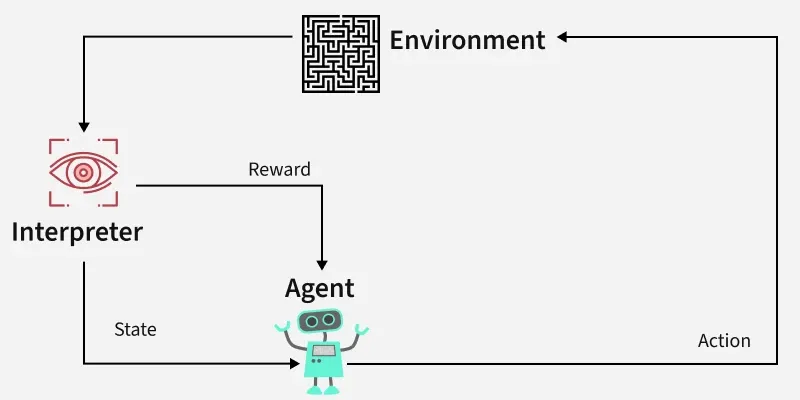
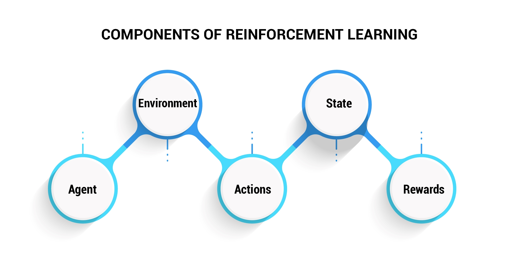
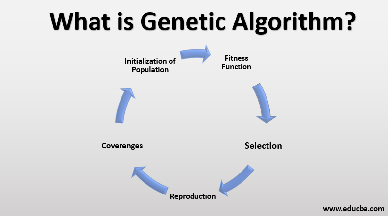
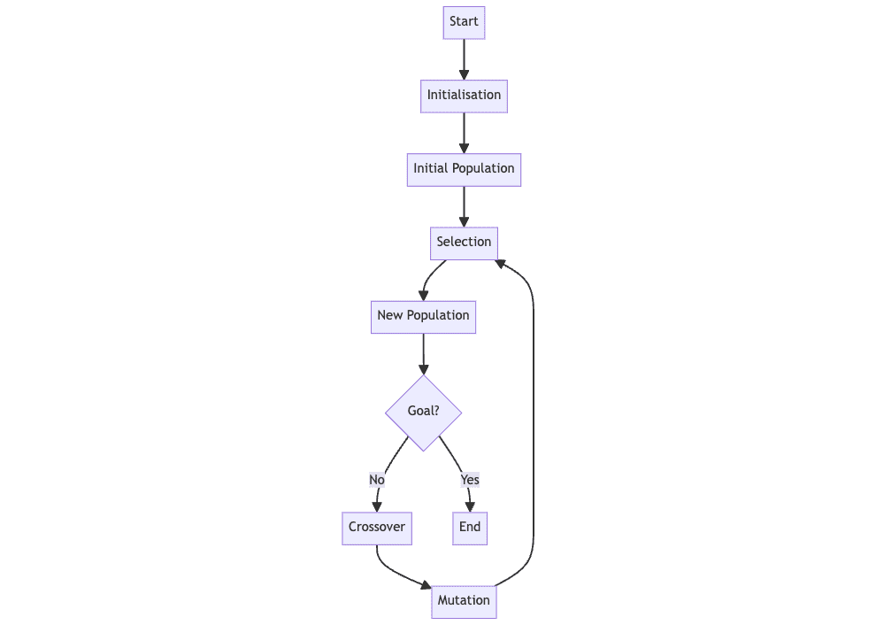

## 🔁 Reinforcement Learning (RL) Kya Hota Hai?



Reinforcement Learning ek **type of machine learning** hai jisme ek **agent** environment ke saath interact karta hai, actions leta hai, aur rewards ya penalties ke basis par **seekhta hai**.

### 🧠 Basic Idea:

Agent try karta hai ki **kaise kaunsa kaam kare** jisse usko **zyada reward mile** ya goal achieve ho jaaye.

---

## 💡 Concepts of Reinforcement Learning



### 1. 🧑 Agent (Agent kya hota hai?)

**Agent** woh hota hai jo environment ke andar actions leta hai aur seekhta hai.

#### 👦 Example:

Socho ek **robot** hai jo ek room mein chalna seekh raha hai. Yeh robot hi RL ka **agent** hai. Wo decide karta hai ki aage jaana hai, peeche, left ya right.

---

### 2. 🌍 Environment (Environment kya hota hai?)

**Environment** wo world ya situation hai jahan pe agent kaam karta hai aur jis se wo interact karta hai.

#### 🏠 Example:

Upar wale example mein **room** jahan robot chal raha hai, wo **environment** hai. Room ke andar obstacles ya walls bhi environment ka part hain.

---


### 3. 📍 State (State kya hota hai?)

**State** matlab agent ki current position ya condition in environment.

#### 🗺️ Example:

Agar robot room ke kone mein khada hai, toh uski state ho sakti hai: "Corner of the room".
Har baar agent move karega toh uski state badlegi.

---

### 4. 🎮 Action (Action kya hota hai?)

**Action** wo decision hai jo agent leta hai kisi state ke andar.

#### 🎯 Example:

Robot 4 actions le sakta hai:

* Move Left
* Move Right
* Move Forward
* Move Backward

Yeh sab actions hain jo agent kisi bhi state mein le sakta hai.

---

### 5. 🎁 Reward (Reward kya hota hai?)

**Reward** ek feedback hai jo agent ko batata hai ki usne sahi kaam kiya ya galat.

#### 💵 Example:

Agar robot sahi direction mein chalta hai to usko +1 reward milta hai. Agar wo wall se takra jata hai to -1 milta hai.

---

### 6. ❌ Penalty (Penalty kya hoti hai?)

**Penalty** ek negative reward hota hai. Jab agent kuch galat karta hai to usko penalty milti hai.

#### ❗ Example:

Wall se takrana, ya goal se door jana — in sab pe agent ko -1, -5, ya aur bhi zyada penalty mil sakti hai.

---

### 7. 📜 Policy (Policy kya hoti hai?)

**Policy** ek rulebook ya strategy hai jisme likha hota hai ki agent har state mein kaunsa action lega.

#### 📘 Example:

Socho robot ne seekh liya hai ki agar wo goal se 2 steps door hai to right move kare. Yeh uski policy hai:
"Jab bhi goal 2 steps right ho, toh right move lo."

---

---

## ⚙️ Tasks in Reinforcement Learning

Ab hum dekhenge RL ke important tasks — jinke through agent seekhta hai.

---

### 1. 🔍 Exploration (Naya explore karna)

Exploration ka matlab hai **naye actions try karna** taaki agent ko pata chale ki kya kya ho sakta hai.

#### 🍽️ Example:

Socho tum ek naye restaurant gaye ho aur naye dishes try kar rahe ho. Tum nahi jaante kaunsa dish best hai, lekin tum explore kar rahe ho.

Robot bhi naye actions try karta hai (shayad galti kare) par seekhta hai.

---

### 2. 💼 Exploitation (Jo seekha uska use karna)

Exploitation ka matlab hai **jo cheezein already seekh li hain**, unko use karke best result lena.

#### 🍕 Example:

Agar tumhe pata chal gaya ki pizza us restaurant ka best dish hai, toh next time tum wahi loge — yeh exploitation hai.

Robot bhi wahi action choose karega jo pehle reward de chuka hai.

---

### 🔁 Balance of Exploration and Exploitation

Agent ko dono ka balance banana hota hai. Sirf explore karega toh waste karega, sirf exploit karega toh naye cheezein seekh nahi payega.

---

### 3. 🧑‍🏫 Learning from Interaction (Interaction se Seekhna)

RL ka agent **apne experience se seekhta hai**. Jab agent environment ke saath interact karta hai (action leta hai, reward milta hai), to usse woh apni policy improve karta hai.

#### 🤖 Example:

Robot har baar move karta hai, dekhta hai kya hua (reward mila ya penalty), aur decide karta hai next time better kya karna hai. Yeh hota hai learning from interaction.

---

## ✅ Recap – Short and Sweet

| Concept                   | Meaning (Hinglish)            | Example                              |
| ------------------------- | ----------------------------- | ------------------------------------ |
| Agent                     | Jo kaam karta hai             | Robot                                |
| Environment               | Jahan pe agent kaam karta hai | Room                                 |
| State                     | Agent ki current situation    | Room ka kone                         |
| Action                    | Agent kya karega              | Move left                            |
| Reward                    | Sahi kaam pe inaam            | +1                                   |
| Penalty                   | Galat kaam pe punishment      | -1                                   |
| Policy                    | Har state mein kya karna hai  | Agar goal dikh raha ho, toh aage jao |
| Exploration               | Naye cheezein try karna       | Nayi dish                            |
| Exploitation              | Jo seekha use use karna       | Best dish order karna                |
| Learning from Interaction | Apne experience se seekhna    | Har baar better decision lena        |

---
## 🎮 Examples: Game Playing aur Robotics mein RL ka Use

### 1. 🕹️ Game Playing

Reinforcement Learning kaafi popular hai games mein, jaise:

#### Example: Chess (Shatranj)

* **Agent**: Chess playing AI (e.g. AlphaZero)
* **Environment**: Chess board
* **State**: Current board position
* **Action**: Next move (e.g., move bishop to D4)
* **Reward**: +1 if it wins, -1 if it loses, 0 otherwise
* **Goal**: Opponent ko harana

Agent seekhta hai har move ka result dekh kar aur gradually better strategy banata hai.

---

### 2. 🤖 Robotics

Robots ko chalana bhi RL ka use case hai.

#### Example: Walking Robot

* **Agent**: Robot
* **Environment**: Physical world (floor, walls)
* **State**: Robot ki current position & posture
* **Action**: Move legs, balance, turn
* **Reward**: +1 for each step, -10 if it falls
* **Goal**: Walk without falling

Robot practice karta hai baar-baar walk karke aur reward dekh ke seekhta hai kaise balance maintain karna hai.

---

## 🧠 What is MDP – Markov Decision Process?

**Markov Decision Process (MDP)** ek mathematical framework hai jo reinforcement learning problems ko model karta hai.

### Simple Language mein:

MDP help karta hai RL ko formally define karne mein — **kaunse states hain, kaunse actions available hain, kya reward milega, aur next state kya hogi**.

---

## 🧩 Components of MDP – Detail mein with Examples

### 1. **State (S)** – Agent ki current condition/environment

Jaise:

* Chess board ka current setup
* Robot ki position and pose

### 2. **Action (A)** – Jo agent kar sakta hai

Jaise:

* Chess mein next move
* Robot ke liye ek step lena

### 3. **Transition Model (T or P)** – Action lene ke baad kaunse state mein jaayenge

Ye probability batata hai ki ek action lene par agent kis new state mein jayega.

#### Example:

* Agar robot aage chale to 90% chance hai ki wo seedha aage jaayega, 10% chance hai ki fisal jaayega (due to slipperiness)

Mathematically:
**P(s' | s, a)** → Probability of going to state `s'` when agent is in state `s` and takes action `a`.

---

### 4. **Reward (R)** – Action ke result ka feedback

* Positive: sahi kaam
* Negative: galat kaam

#### Example:

* Chess mein jeetne par +1, harne par -1
* Robot gir gaya toh -10

Mathematically:
**R(s, a, s')** → Reward milta hai jab agent `s` state se `a` action leta hai aur `s'` state mein pahuchta hai.

---

### 5. **Policy (π)** – Agent ka action plan

Ye ek **strategy** hai jo batata hai ki agent har state mein kaunsa action lena chahiye.

#### Example:

* Agar goal 2 steps left hai, toh hamesha left move lo
* Chess mein agar opponent queen ko khula chhodta hai, toh capture karo

Mathematically:
**π(s)** → policy ek function hai jo batata hai state `s` mein kaunsa best action lena hai.

---

## 🔁 MDP Framework Summary Table

| Component                   | Explanation (Hinglish)                                | Example                              |
| --------------------------- | ----------------------------------------------------- | ------------------------------------ |
| **S: State**                | Agent ki current condition                            | Chess board ka current position      |
| **A: Action**               | Agent kya kar sakta hai                               | Next move in chess                   |
| **T(s, a, s’): Transition** | Action lene ke baad kya state banegi (probability se) | 90% chance aage chalega, 10% fislega |
| **R(s, a, s’): Reward**     | Action ke baad kya mila                               | +1 for winning                       |
| **π(s): Policy**            | Har state mein kya karna hai                          | Always attack open queen             |

---

## 🧭 Why is MDP important?

* RL problems ko formally define karta hai
* Learning aur planning ke liye mathematical base deta hai
* MDP ke basis pe algorithms banaye jaate hain jaise Q-Learning, SARSA, etc.

---

## 🎯 Simple Example of MDP: Grid World

Socho ek robot ek 3x3 grid mein hai, goal hai top-right corner pe pahuchna.

|         |   | 🎯Goal |
| ------- | - | ------ |
|         |   |        |
| 🤖Start |   |        |

* **States**: Har grid ka ek cell = ek state
* **Actions**: Up, Down, Left, Right
* **Reward**: +10 on reaching goal, -1 for each move
* **Transitions**: Movement 90% accurate, 10% random
* **Policy**: Go toward the goal direction

---

## 🔍 What is **Q-Learning**?

**Q-Learning** ek type ka **Reinforcement Learning algorithm** hai jo agent ko sikhata hai ki **kaunse action kis state mein lena chahiye** taaki **maximum reward mil sake**.

Q-Learning ka goal hota hai:
👉 **Best policy** (π\*) seekhna
👉 Har state ke liye **best action** find karna

---

## 💡 Simple Idea:

Agent har state mein har action ko **try** karta hai, aur dekhta hai uska **reward kya mila**, aur usse **seekhta hai**.
Ye seekhne ki process Q-value se hoti hai.

---

## 🔢 What is **Q-Function**?

**Q(s, a)** = **Quality** of taking action **a** in state **s**

Yaani:
"Agar main state `s` mein hoon aur action `a` leta hoon, toh mujhe kitna reward milega **aaj aur future mein total**?"

---

### ✅ Goal of Q-Learning:

Learn Q-values for all (state, action) pairs:

* High Q-value → Achha action
* Low Q-value → Bura action

---

## 📘 Q-Learning Algorithm: Step-by-Step

Chaliye ab full algorithm samjhte hain:

---

### 🔁 Step 1: **Initialize Q-table**

Ek **Q-table** banao jisme rows = states aur columns = actions hote hain
Sab Q-values initially 0 set karo

```plaintext
Q[s][a] = 0 for all s ∈ States, a ∈ Actions
```

---

### 🎲 Step 2: **Choose action using ε-greedy policy**

Agar `random < ε (epsilon)`:

* 🔍 **Explore**: Random action lo (new cheez try karo)

Warna:

* ✅ **Exploit**: Maximum Q-value wala action lo

```plaintext
If random < ε:
   choose random action (exploration)
Else:
   choose action with max Q(s, a) (exploitation)
```

---

### 🎮 Step 3: **Take Action → Observe Reward and New State**

* Agent current state `s` se action `a` leta hai
* Us action ka result aata hai: new state `s'` and reward `r`

---

### 🔄 Step 4: **Update Q-value using Bellman Equation**

```plaintext
Q(s, a) = Q(s, a) + α * [r + γ * max Q(s', a') - Q(s, a)]
```

#### Yahan:

* `s` = current state
* `a` = action taken
* `r` = reward
* `s'` = new state
* `α` = learning rate (0 to 1) – kitna seekhna hai
* `γ` = discount factor (0 to 1) – future reward ka importance
* `max Q(s', a')` = new state ke best action ka Q-value

---

### 🔁 Step 5: **Repeat**

Ye process baar baar repeat hoti hai **episodes** ke through, jab tak Q-values stable ho jaayein.

---

## 📘 Example: Simple Grid World

Sochiye agent ek 3x3 grid mein hai. Goal hai top-right corner pe pahuchna.

* **States**: Grid cells (like (0,0), (0,1), etc.)
* **Actions**: Up, Down, Left, Right
* **Rewards**:

  * Reaching Goal = +10
  * Each step = -1
  * Hitting wall = -5

Agent har cell mein try karta hai har direction jaane ka aur gradually learn karta hai kaunsa action best hai.

---

## 🧠 Summary Table

| Concept              | Meaning (Hinglish)                           |
| -------------------- | -------------------------------------------- |
| Q-Function `Q(s, a)` | Kis state mein kaunsa action kitna achha hai |
| Q-table              | Table jahan Q-values store hoti hain         |
| Learning Rate `α`    | Kitni speed se agent seekhta hai             |
| Discount Factor `γ`  | Future rewards ka importance                 |
| ε (epsilon)          | Kitna explore kare (vs exploit)              |

---

## ✅ Final Q-Learning Algorithm (in simple pseudocode)

```python
Initialize Q[s][a] = 0 for all states s and actions a
Repeat for each episode:
    Initialize state s
    Repeat until episode ends:
        Choose action a using ε-greedy policy from Q[s]
        Take action a → observe reward r and new state s'
        Q[s][a] = Q[s][a] + α * (r + γ * max(Q[s'][a']) - Q[s][a])
        s = s'
```

---

## 🧠 What is **Deep Q-Learning (DQN)**?

**Deep Q-Learning** = Q-Learning + Deep Neural Networks

### 💡 Problem with Q-Learning:

* Agar state space **bahut bada ho (infinite or continuous)**, to Q-table banani **na-mumkin** ho jaati hai.

### ✅ Solution:

Use a **Neural Network** to **approximate** the Q-function:

```plaintext
Q(s, a) ≈ Neural Network(s, a)
```

Isko kehte hain **Deep Q-Network (DQN)**

---

## 🔗 Components of Deep Q-Learning:

### 1. 🧠 Neural Network (Q-Network)

Ek neural network jo input mein **state** leta hai aur output mein **har action ka Q-value** deta hai.

#### Example:

Input: State (e.g., image of game screen)
Output: \[Q(s, Left), Q(s, Right), Q(s, Up), Q(s, Down)]

Agent is output se **best action** choose karta hai.

---

### 2. 💾 Experience Replay

### ❓Problem:

Agent agar har experience ko **turant use kare** to wo learning unstable ho jaata hai (due to correlations).

### ✅ Solution:

* Agent har experience `(s, a, r, s')` ko **memory (buffer)** mein store karta hai.
* Fir random mini-batches uthake training karta hai.

### 🎯 Benefit:

* Data decorrelated hota hai
* Learning smooth ho jaata hai

---

### 3. 🎯 Target Network

### ❓Problem:

Q-network ko train karte waqt, **same network** se prediction bhi lena aur target bhi banana unstable hota hai.

### ✅ Solution:

Do neural networks use karte hain:

* **Main Q-network (live update hota hai)**
* **Target Q-network (fixed hota hai thodi der ke liye)**

Target Q-network har kuch steps baad **main Q-network ki copy** ban jaata hai.

```plaintext
Target = r + γ * max Q_target(s’, a’)
```

---

## 📘 DQN Summary Table

| Component         | Explanation (Hinglish)                               |
| ----------------- | ---------------------------------------------------- |
| Q-Network         | State se action-value predict karta hai              |
| Experience Replay | Memory buffer jahan past experiences store hote hain |
| Target Network    | Stable learning ke liye fixed Q-network              |
| Loss Function     | Error between predicted & target Q-values            |
| Optimizer         | Network ko train karta hai (e.g., Adam, SGD)         |

---

## 🧬 Genetic Algorithms (GAs) – In RL & Optimization



Genetic Algorithms ek **biological inspiration** pe based optimization technique hai — like **evolution**.

Agent koi fixed learning rule follow nahi karta, balki **population of solutions** try karta hai, aur gradually improve karta hai.

---



### 🧬 Steps of Genetic Algorithm (GA):

---

### 1. **Initialization**

* Ek population banti hai random solutions ki.
* Har solution = ek **chromosome** (e.g., neural network weights, policies, etc.)

#### Example:

Sochiye 10 neural networks hain, har ek randomly initialized hai — yeh population hai.

---

### 2. **Selection**

* **Best-performing solutions** ko choose karo next generation ke liye.
* Based on **fitness** (e.g., reward mila kitna)

#### Example:

Top 3 neural networks jo sabse zyada reward laaye game mein — unko select karte hain.

---

### 3. **Crossover (Recombination)**

* 2 parents ke genes combine karke new solution banta hai (like kids)

#### Example:

Parent A ka half weights + Parent B ka half weights = new child network

---

### 4. **Mutation**

* Random thoda change introduce karte hain (exploration ke liye)
* Helps to discover new strategies

#### Example:

Neural network ke ek weight ko randomly +0.01 ya -0.02 change kar diya

---

### 5. **Replacement**

* New generation create karo by combining:

  * Best from old population
  * New offspring (from crossover + mutation)

---

### 6. **Iteration**

* Ye process multiple generations tak repeat hoti hai:

  * Selection → Crossover → Mutation → Replacement
* Har baar population improve hoti hai

---

## 🧠 Use of Genetic Algorithms in RL

* **Policy optimization**: RL policies ko evolve karna
* **Neural network weights** optimize karna
* **No need for gradient** (GA is gradient-free)

---

## 📘 Summary Table of GA Steps

| Step           | Explanation (Hinglish)                      |
| -------------- | ------------------------------------------- |
| Initialization | Random se population banana                 |
| Selection      | Best agents choose karna                    |
| Crossover      | 2 agents ko mix karke naya banana           |
| Mutation       | Thoda randomness add karna                  |
| Replacement    | New generation create karna                 |
| Iteration      | Process repeat karna for better performance |

---

## 🧠 Final Note: DQN vs Genetic Algorithms

| Feature               | DQN                     | Genetic Algorithms            |
| --------------------- | ----------------------- | ----------------------------- |
| Learning Type         | Gradient-based          | Evolution-based               |
| Uses Neural Network   | ✅                       | ✅ (can be)                    |
| Needs Backpropagation | ✅                       | ❌                             |
| Good for              | Complex problems, games | Exploration, policy evolution |
| Training Method       | Q-value prediction      | Population-based optimization |

---
