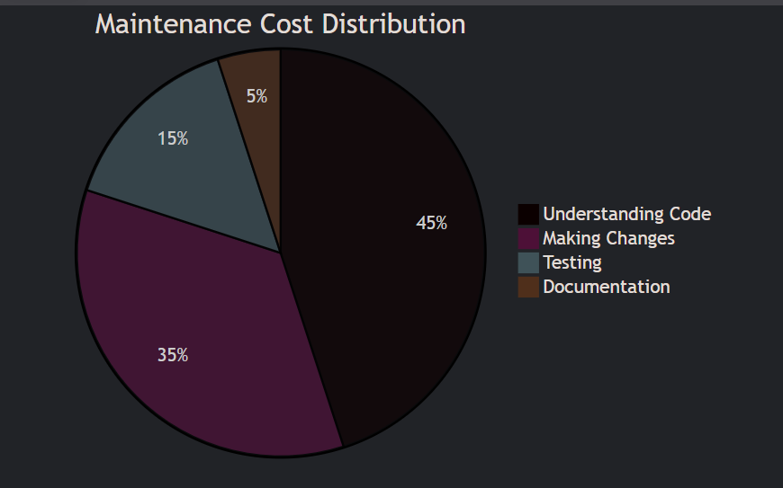
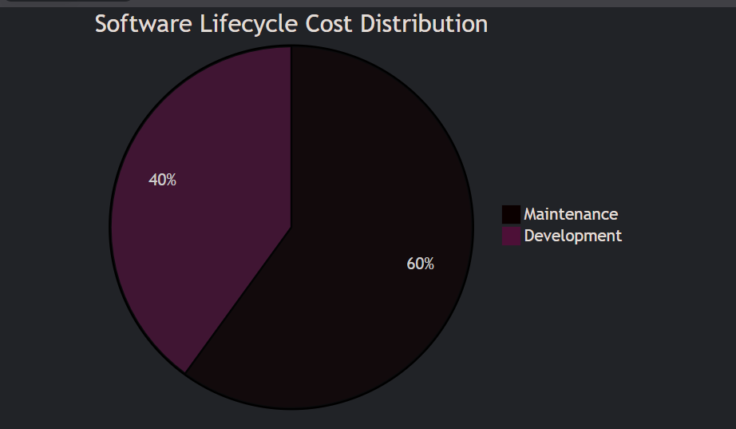

# **Comprehensive Guide to Software Maintenance and Project Management**

## **1. Software Maintenance**

### **1.1 Software as an Evolutionary Entity**
- **Lehman's Laws of Software Evolution**:
  1. **Continuing Change**: Systems must adapt or become progressively less useful
  2. **Increasing Complexity**: Systems grow more complex unless actively maintained
  3. **Self-Regulation**: System evolution processes are self-regulating
  4. **Conservation of Organizational Stability**: Development speed remains constant
  5. **Conservation of Familiarity**: Incremental changes preserve knowledge

### **1.2 Need for Maintenance**
- **Industry Statistics**:
  - 60-75% of total software lifecycle costs
  - 40-60% of IT budgets allocated to maintenance
  - Typical maintenance ratio: 1 developer maintains 50K-100K LOC

### **1.3 Categories of Maintenance**
| **Type**          | **Description**                                                                 | **Example**                                      | **% Effort** |
|--------------------|---------------------------------------------------------------------------------|--------------------------------------------------|-------------|
| **Corrective**     | Fixing defects and errors                                                       | Bug in login authentication                     | 20%         |
| **Adaptive**       | Modifications for environment changes                                           | OS upgrade compatibility                        | 25%         |
| **Perfective**     | Enhancing functionality/performance                                             | Adding new reporting feature                    | 50%         |
| **Preventive**     | Improving future maintainability                                               | Refactoring legacy code                         | 5%          |

### **1.4 Cost of Maintenance**
- **Factors Affecting Cost**:
  - System age (cost increases exponentially after 5 years)
  - Documentation quality
  - Staff turnover
  - Original design quality

- **Cost Distribution**:

### **1.5 Software Re-engineering**
- **Process Model**:
  1. Inventory analysis
  2. Document reconstruction
  3. Reverse engineering
  4. Code restructuring
  5. Data restructuring
  6. Forward engineering

- **Benefits**:
  - 30-50% cost savings vs. new development
  - Preserves business logic
  - Improves maintainability

### **1.6 Reverse Engineering**
- **Approaches**:
  - **Design Recovery**: Recreating higher-level abstractions
  - **Program Understanding**: Analyzing control/data flow
  - **Visualization**: Generating UML diagrams from code

- **Tools**:
  - IDA Pro (Binary analysis)
  - Understand (Code analysis)
  - Moose (Software analysis)

## **2. Software Configuration Management (SCM)**

### **2.1 Core Activities**
1. **Version Control**:
   - File versioning
   - Branching strategies (Git Flow, GitHub Flow)
   - Atomic commits

2. **Change Control**:
   - Request submission
   - Impact analysis
   - Approval workflow
   - Implementation tracking

3. **Build Management**:
   - Continuous Integration
   - Reproducible builds
   - Dependency management

### **2.2 Change Control Process**

### **2.3 Version Control Strategies**
- **Centralized vs Distributed**:
  | **Aspect**        | **Centralized (SVN)**       | **Distributed (Git)**         |
  |-------------------|----------------------------|-------------------------------|
  | **Repository**    | Single central server      | Every clone is full repo      |
  | **Branching**     | Expensive                  | Cheap and fast                |
  | **Work Offline**  | Limited                    | Full functionality            |

### **2.4 CASE Tools Overview**
- **Categories**:
  - **Upper CASE**: Requirements/design tools (Enterprise Architect)
  - **Lower CASE**: Implementation tools (Eclipse)
  - **Integrated CASE**: Full lifecycle (IBM Rational)
  
- **Popular Tools**:
  - Version Control: Git, SVN
  - Build Automation: Jenkins, Maven
  - Change Management: JIRA, Bugzilla

## **3. Software Project Management**

### **3.1 Estimation Techniques**
#### **COCOMO Models**
| **Model**       | **Equation**                          | **Best For**                   |
|-----------------|---------------------------------------|--------------------------------|
| **Basic**       | PM = a×(KLOC)^b                       | Early rough estimates          |
| **Intermediate**| PM = a×(KLOC)^b × EAF                 | More accurate estimates        |
| **Detailed**    | Phase-wise calculations               | Precise planning               |

**Coefficients**:
- Organic: a=2.4, b=1.05
- Semi-detached: a=3.0, b=1.12
- Embedded: a=3.6, b=1.20

**Example Calculation**:
For 50 KLOC semi-detached project:
PM = 3.0 × (50)^1.12 ≈ 3.0 × 79.6 ≈ 239 person-months

#### **Function Point Analysis**
- **Adjusted FP** = Unadjusted FP × [0.65 + (0.01 × ΣFi)]
- **Effort** = FP × Productivity Factor
- **Typical Productivity**:
  - 10 FP/month (low experience)
  - 20 FP/month (average)
  - 30+ FP/month (high experience)

### **3.2 Resource Allocation**
- **Team Structures**:
  - **Chief Programmer Team** (Hierarchical)
  - **Democratic Team** (Egoless approach)
  - **Hybrid Team** (Scrum teams)

- **Brooks' Law**:
  "Adding manpower to a late software project makes it later"

### **3.3 Risk Management**
#### **Risk Identification**
- Technical risks (new technologies)
- Project risks (schedule, budget)
- Business risks (market changes)
- People risks (staff turnover)

#### **Risk Analysis Matrix**
| **Probability** \ **Impact** | Low | Medium | High |
|-----------------------------|-----|--------|------|
| **High**                    | Monitor | Mitigate | Avoid |
| **Medium**                  | Accept | Transfer | Mitigate |
| **Low**                     | Accept | Accept | Monitor |

#### **Risk Mitigation Strategies**
1. **Avoidance**: Change project plan
2. **Transfer**: Outsource risky components
3. **Mitigation**: Reduce probability/impact
4. **Acceptance**: Contingency planning

## **4. Key Metrics and Models**

### **4.1 Maintenance Metrics**
- **Mean Time to Repair (MTTR)**: Average defect fix time
- **Backlog Index**: (Open requests/Closed requests) × 100
- **Maintenance Productivity**: LOC/Person-day

### **4.2 Project Success Factors**
1. Clear requirements (30% of success)
2. User involvement (15%)
3. Executive support (12%)
4. Realistic schedules (10%)

### **4.3 Cost Distribution**

## **5. Emerging Trends**
- **AI in Maintenance**:
  - Automated bug detection
  - Predictive maintenance
  - Code smell detection

- **DevOps for SCM**:
  - Infrastructure as Code
  - Continuous Deployment
  - Immutable infrastructure

This comprehensive approach to maintenance and project management ensures:
✔ Extended software lifespan  
✔ Controlled evolution  
✔ Effective resource utilization  
✔ Risk minimization  
